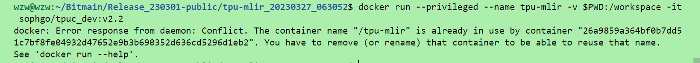
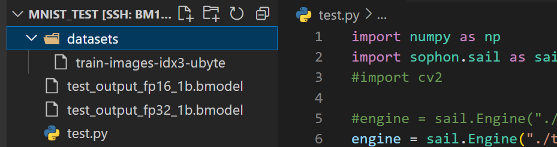

# 算法部署大致流程

# 移植步骤
首先搭建好自己的网络模型，并导出为onnx格式--具体可以参照--> 
https://github.com/warren-wzw/MNIST-pytorch.git
## 将onnx模型使用tpu-mlir工具转化为bmodel格式
1：在tpu-mlir目录下进入docker
docker run --privileged --name tpu-mlir -v $PWD:/workspace -it sophgo/tpuc_dev:v2.2

原因：该镜像已创建，要么重新创建一个新进程，要么杀死老进程；
解决办法如下：

2:接着设置一下环境
source envsetup.sh！！！重要 别忘了
3:进入/workspace/sophon-demo/sample
复制一份YOLOv5并命名为export_model，这里我们将不需要的文件都删除，保留下图文件即可；其中将转化好的onnx模型拷贝一份到以下目录
/workspace/sophon-demo/sample/export_model/models/onnx

4：转化为fp32格式
cd /workspace/sophon-demo/sample/export_model/scripts
修改gen_fp32bmodel_mlir.sh，主要修改gen_mlir()以及gen_fp32bmodel()
```bash 
function gen_mlir()
{
    model_transform.py \
        --model_name test_output \
        --model_def ../models/onnx/model.onnx \
        --mlir test_output_$1b.mlir
}

function gen_fp32bmodel()
{
    model_deploy.py \
        --mlir test_output_$1b.mlir \
        --quantize F32 \
        --chip $target \
        --model test_output_fp32_$1b.bmodel

    mv test_output_fp32_$1b.bmodel $outdir/
}
```
执行 ./gen_fp32bmodel_mlir.sh BM1684X 即可

5:转化为fp16
修改gen_fp16bmodel_mlir.sh，主要修改gen_mlir()以及gen_fp16bmodel()
```bash
{
    model_transform.py \
        --model_name test_output \
        --model_def ../models/onnx/model.onnx \
        --mlir test_output_$1b.mlir
}

function gen_fp16bmodel()
{
    model_deploy.py \
        --mlir test_output_$1b.mlir \
        --quantize F16 \
        --chip $target \
        --model test_output_fp16_$1b.bmodel

    mv test_output_fp16_$1b.bmodel $outdir/
} 
```
执行./gen_fp16bmodel_mlir.sh BM1684X

执行成功后可以看到在以下路径生成的bmodel
/workspace/sophon-demo/sample/export_model/models/BM1684X

6：转化为int8
参考《TPU-MLIR开发参考手册》量化章节
至此，模型转化完成，bmodel主要用于BM1684X的板端推

bmodel模型拷贝至板端：scp test_output_fp* linaro@10.12.13.66:/data
远程连接另一台linux--->ssh -p 22 linaro@10.12.13.66
# 板端部署
## 板端环境搭建
[在板端搭建好sophon-sail环境](http://t.csdnimg.cn/DWBVW)
## python版本
在板端新建一个MNIST文件夹，文件目录如下，其中datasets存放测试数据集train-images-idx3-ubyte，test_output_fp16_1b.bmodel以及test_output_fp32_1b.bmodel为onnx转化后的bmodel模型，test.py为测试代码。

3）主要的原理就是使用sophon提供的api加载能够适配于BM1684X的bmodel类型的模型，并使用他们的api进行模型的推理，可以参考[官方sail的API](https://doc.sophgo.com/sdk-docs/v23.03.01/docs_latest_release/docs/sophon-sail/docs/zh/html/2_module.html)
4）下面讲解一下测试代码
```python
#import cv2
import numpy as np
import sophon.sail as sail
import time

num = -1 
inference_time =[0]
print("--0-5 1-0 2-4 3-1 4-9 5-2 6-1 7-3 8-1 9-4 for example:if num =9 the pic's num is 4")
 
engine = sail.Engine("./test_output_fp32_1b.bmodel",0,sail.IOMode.SYSIO) #load model-use FP32model on tpu-0 and use sys memery
#engine = sail.Engine("./test_output_fp16_1b.bmodel",0,sail.IOMode.SYSIO) #load model-use FP16 on tpu-0 and use sys memery

graph_name =engine.get_graph_names()[0]                      #get_graph_names-test_output
input_tensor_name = engine.get_input_names(graph_name)[0]    #get_input_names-input.1
output_tensor_name = engine.get_output_names(graph_name)[0]  #get_output_names-25_LogSoftmax

batchsize,channel,height,width = engine.get_input_shape(graph_name,input_tensor_name) #get batchsize-1,channel-1,input image's height-28 & width-28

#read image
with open("./datasets/train-images-idx3-ubyte","rb") as f:
    file = f.read()
for i in range(8000): 
    num =num +1  
    i = 16+784*num
    image1 = [int(str(item).encode('ascii'),16) for item in file[i:i+784]]

    #reshap input data
    input_data = np.array(image1,dtype=np.float32).reshape(1,1,28,28)  #reshape the image to 1 1 28 28
    input_data_final = {input_tensor_name:input_data}     #because the process's parmeter(input_data)  must be dictionary so use{}
    start_time = time.time()
    outputs = engine.process(graph_name,input_data_final) #model inference
    end_time = time.time()
    inference_time.append(end_time - start_time)  
 
    result = outputs[output_tensor_name]  #use output_tensor_name to get the tensor
    max_value=np.argmax(result)           #get the index of the best score
    print("----------------------------------the result is ",max_value,"the time is ",inference_time[num]*1000,"ms")

mean = (sum(inference_time) / len(inference_time))*1000
print("-----FP32--","loop ",num+1,"times","average time",mean,"ms") 
```
5）测试结果
FP32

FP16

基本稳定在4%峰值可达8%

## C++版本
首先安装好[c++交叉编译环境](http://t.csdnimg.cn/kjRsG)
1：采用交叉编译的方式进行编译，新建文件夹MNIST
文件结构

CMakeFile.txt
```bash
set(CMAKE_C_COMPILER aarch64-linux-gnu-gcc)
set(CMAKE_ASM_COMPILER aarch64-linux-gnu-gcc)
set(CMAKE_CXX_COMPILER aarch64-linux-gnu-g++)

include_directories("/home/wzw/soc-sdk/include")
include_directories("/home/wzw/soc-sdk/include/sail")
# 添加交叉编译需要使用的头文件目录

link_directories("/home/wzw/soc-sdk/lib")
# 添加交叉编译需要使用的动态库目录

set(SOURCE_FILES main.cpp)
set(TARGET_NAME MNIST)
add_executable(${TARGET_NAME} ${SOURCE_FILES})
target_link_libraries(${TARGET_NAME} sail)
# sail为需要链接的库
```
main.cpp
```c++
#define USE_FFMPEG 1
#define USE_OPENCV 1
#define USE_BMCV 1
#include <stdio.h>
#include <sail/cvwrapper.h>
#include <iostream>
#include <string>
#include <numeric>
#include <sys/time.h>

#include "spdlog/spdlog.h"
#include "spdlog/fmt/fmt.h"
#include "engine.h"

using namespace std;
using namespace sail;
const std::string& bmodel_path_fp32="./test_output_fp32_1b.bmodel";
const std::string& bmodel_path_fp16="./test_output_fp16_1b.bmodel";
const int MODEL_IN_WIDTH = 28;
const int MODEL_IN_HEIGHT = 28;
const int MODEL_CHANNEL = 1;
const int loop_count = 1000;
int num = -1;

static inline int64_t getCurrentTimeUs()
{
    struct timeval tv;
    gettimeofday(&tv, NULL);
    return tv.tv_sec * 1000000 + tv.tv_usec;
}
void Load_data(int num,unsigned char * input_image)
{
    int j=16+784*num;
    FILE *file = fopen("./datasets/train-images-idx3-ubyte", "rb");
    if (file == NULL) {
        printf("can't open the file!\n");
    }
    fseek(file,j,SEEK_SET);
    fread(input_image,sizeof(char),784,file);
/*     for(int i=0;i<MODEL_IN_WIDTH;i++){
        for(int j=0;j<MODEL_IN_WIDTH;j++){
            printf("%4d",input_image[i*28+j]);
        }
        printf("\n");
    } */ 
    fclose(file);
}

void Array_change(float input_aray[][MODEL_CHANNEL][MODEL_IN_WIDTH][MODEL_IN_HEIGHT],unsigned char *input_image)
{
   int index=0;
    for (int i = 0; i < 1; i++) {
        for (int j = 0; j < MODEL_CHANNEL; j++) {
            for (int k = 0; k < MODEL_IN_HEIGHT; k++) {
                for (int l = 0; l < MODEL_IN_WIDTH; l++) {
                    input_aray[i][j][k][l] = (float)input_image[index++];
                    //cout<<input_aray[i][j][k][l]<<" ";
                }
                //cout<<endl;
            }
        }
        //cout<<endl;
    } 
}

void Bubble_sort(float *buffer,int num)
{
    float temp;
    for(int i=0; i<num;i++){
        for(int j=0; j<num-i-1;j++){
            if(buffer[j]>buffer[j+1]){
                temp = buffer[j];
                buffer[j]=buffer[j+1];
                buffer[j+1]=temp;
            }
        }
    }
}

void dump_shape(std::vector<int> shape)
{
    cout<<"[  ";
    for (const int& value : shape) {
        std::cout << value << " ";
    }
     cout<<"]"<<endl;
}
bool inference(int device_id)
{
    int64_t time[loop_count] = {};
    unsigned char input_image[784]={};
    float input_aray[1][MODEL_CHANNEL][MODEL_IN_HEIGHT][MODEL_IN_WIDTH]={};
    int64_t sum=0;
    float buffer_copy[]={};
    // init Engine
    sail::Engine engine(device_id);    
    // load bmodel without builtin input and output tensors
    engine.load(bmodel_path_fp32);
    // get model info
    auto graph_name = engine.get_graph_names().front();
    auto input_name = engine.get_input_names(graph_name).front();
    auto output_name = engine.get_output_names(graph_name).front();
    std::vector<int> input_shape = {1, 1, 28, 28};
    std::map<std::string, std::vector<int>> input_shapes;
    input_shapes[input_name] = input_shape;
    auto output_shape = engine.get_output_shape(graph_name, output_name);
    auto input_dtype = engine.get_input_dtype (graph_name, input_name);
    auto output_dtype = engine.get_output_dtype(graph_name, output_name);
    cout<<"----------------graph_name is "<<graph_name<<endl;
    cout<<"----------------input_name is "<<input_name<<endl;
    cout<<"----------------output_name is "<<output_name<<endl;
    cout<<"----------------input_dtype is "<<input_dtype<<endl;
    cout<<"----------------output_dtype is "<<output_dtype<<endl;
    cout<<"output shape is ";
    dump_shape(output_shape);
    cout<<"input shape is ";
    dump_shape(input_shape);
    // get handle to create input and output tensors
    sail::Handle handle = engine.get_handle();

    // allocate input and output tensors with both system and device memory
    sail::Tensor in(handle, input_shape, input_dtype, true, true);
    sail::Tensor out(handle, output_shape, output_dtype, true, true);
    std::map<std::string, sail::Tensor*> input_tensors = {{input_name, &in}};
    std::map<std::string, sail::Tensor*> output_tensors = {{output_name, &out}};
    // prepare input and output data in system memory with data type of float32
    float* input = nullptr;
    float* output = nullptr;
    int in_size = std::accumulate(input_shape.begin(), input_shape.end(),
                                    1, std::multiplies<int>());
    int out_size = std::accumulate(output_shape.begin(), output_shape.end(),
                                    1, std::multiplies<int>());
    if (input_dtype == BM_FLOAT32) {
        input = reinterpret_cast<float*>(in.sys_data());
    } 
    else {
        input = new float[in_size];
    }
    if (output_dtype == BM_FLOAT32) {
        output = reinterpret_cast<float*>(out.sys_data());
    } 
    else {
        output = new float[out_size];
    }
    //loop 
    for(int times=0;times<loop_count;times++) {
        num++;
        Load_data(num,input_image);
        Array_change(input_aray,input_image);
        bool status=in.own_dev_data();
        cout<<"own_dev_data "<<status<<endl;
        status=in.own_sys_data();
        cout<<"own_sys_data "<<status<<endl;
        in.reset_sys_data(input_aray,input_shape);
         
        // set io_mode SYSO:Both input and output tensors are in system memory.
        engine.set_io_mode(graph_name, sail::  SYSIO);

        bm_data_type_t ret =in.dtype();
        printf("in.dtype is %d\n", ret);

        //inference
        int64_t start_time = getCurrentTimeUs();
        engine.process(graph_name, input_tensors, input_shapes, output_tensors);
        int64_t end_time = getCurrentTimeUs();
        time[times]=end_time-start_time;
        sum = sum+time[times];
        //post process
        auto real_output_shape = engine.get_output_shape(graph_name, output_name);
        float* output_data = reinterpret_cast<float*>(out.sys_data());
        for(int i = 0; i < 10;i++){
            buffer_copy[i]=output_data[i];
            //printf("output_data is %f \n",output_data[i]);
        }
        Bubble_sort(output_data,10);
        for(int i =0;i<10;i++){
            if(buffer_copy[i]==output_data[9]){
                printf("------------------------------------------the pic value is %d \n",i);
            }
        }

        /* cout<<"real_output_shape is "<<"[  ";
        dump_shape(real_output_shape);*/
        printf(": Elapse Time = %.3f ms \n", time[times] / 1000.f);
    }
    printf("--------loop %d times sum is %.4f ms average time is %.3f ms\n", loop_count,sum / 1000.f,(sum / 1000.f)/loop_count);
    return true;
}
int main()
{
    int device_id = 0;
    int tpu_num=get_available_tpu_num();
    printf("the tpu number is %d\n", tpu_num);
    
    bool status = inference(device_id);
    return 0;    
}
```
打印结果


fp32

fp16

int8


## 关于作者
* warren@伟
* 个人博客：具体内容可以参考我的博客[CSDN-warren@伟](https://blog.csdn.net/warren103098?type=blog)
