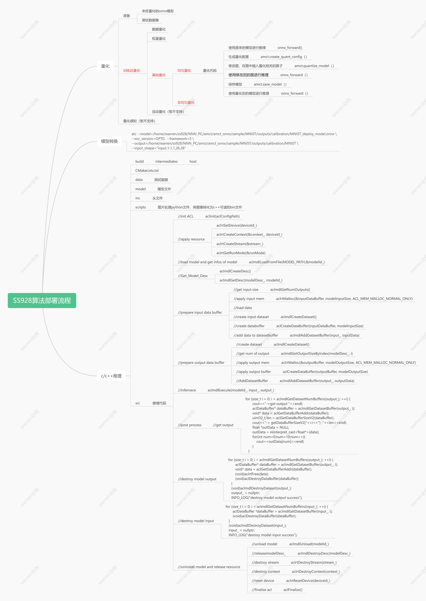
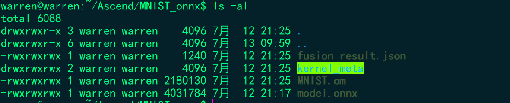
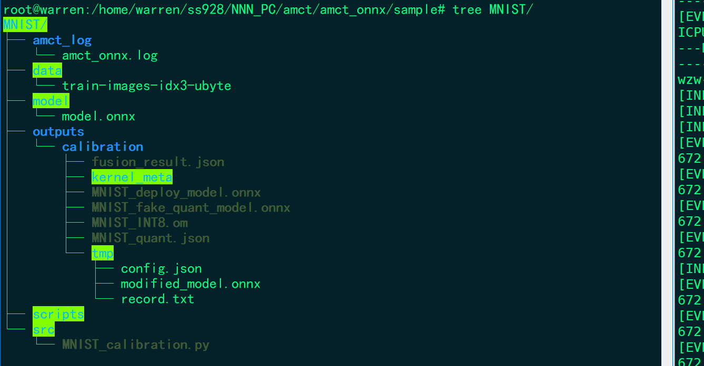
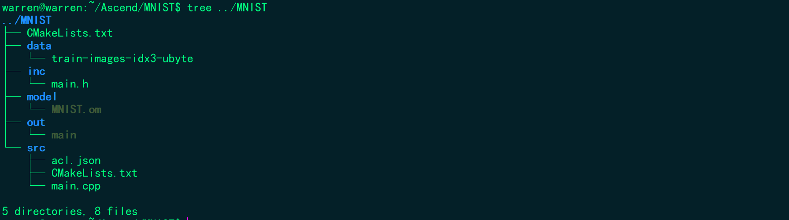
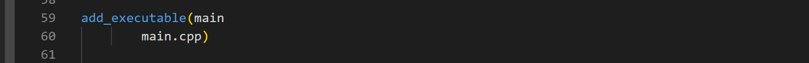
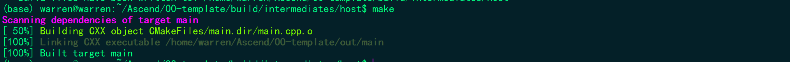
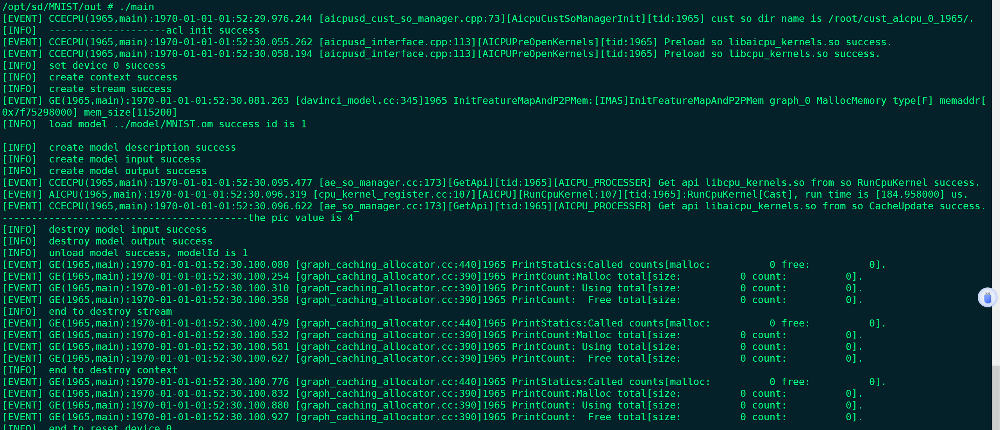
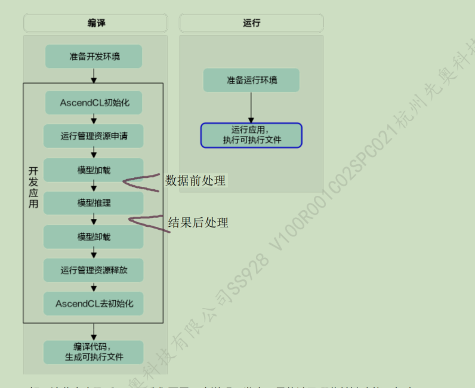
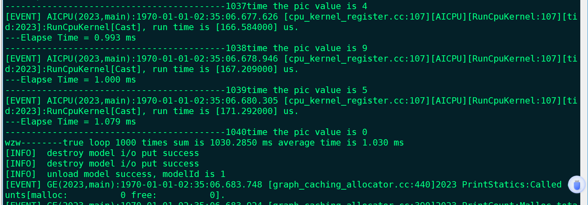
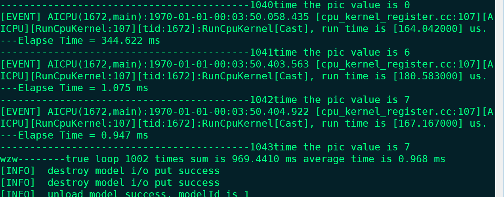

# 大致流程

# 模型转换
1：准备[MNIST的onnx模型](https://gitee.com/warren-wei/mnist-pytorch.git)
## 搭建好ATC的环境 
[海思SS928搭建NNN环境并添加opencv库](http://t.csdnimg.cn/vqY0J)
## 首先设置环境变量
```bash
source /home/warren/Ascend/ascend-toolkit/latest/x86_64-linux/bin/setenv.bash
```
## 转化模型
```bash
atc --model=/home/warren/ss928/NNN_PC/amct/amct_onnx/sample/MNIST/outputs/calibration/MNIST_deploy_model.onnx \
--soc_version=OPTG  --framework=5 \
--output=/home/warren/ss928/NNN_PC/amct/amct_onnx/sample/MNIST/outputs/calibration/MNIST \
--input_shape="input0:1,3,640,640" 
```
模型转化成功后得到以下文件

# 模型量化
目录结构

```python 
import os
import argparse
import cv2
import numpy as np
import onnxruntime as ort
import time
import torch

import amct_onnx as amct

PATH = os.path.realpath('./')
DATA_DIR = os.path.join(PATH, 'data')
PARSER = argparse.ArgumentParser(description='amct_onnx MNIST quantization sample.')
ARGS = PARSER.parse_args()
OUTPUTS = os.path.join(PATH, 'outputs/calibration')
TMP = os.path.join(OUTPUTS, 'tmp')

def onnx_forward(onnx_model, batch_size=1, iterations=100):
    ort_session = ort.InferenceSession(onnx_model, amct.AMCT_SO)
    with open("./data/train-images-idx3-ubyte","rb") as f:
        file = f.read()
        num = -1
        j=0
        inference_time =[0]
        for j in range(100):
            num=num+1
            i = 16+784*num
            image1 = [int(str(item).encode('ascii'),16) for item in file[i:i+784]]
            input_data = np.array(image1,dtype=np.float32).reshape(1,1,28,28)
            #np.set_printoptions(linewidth=150)
            #print(input_data)
            input_name = ort_session.get_inputs()[0].name
            # inference
            start_time = time.time()
            output = ort_session.run(None, {input_name: input_data})
            end_time = time.time()
            inference_time.append(end_time - start_time)
            # 处理输出结果
            output = torch.tensor(output[0])  # 将输出转换为 PyTorch 张量
                #print(output_tensor)
            # 输出结果处理和后续操作...
            pred =np.argmax(output)
            print("------------------------The num of this pic is ",pred,"use time ",inference_time[num]*1000,"ms",j)

def main():
    model_file = './model/model.onnx'
    print('[INFO] Do original model test:')
    onnx_forward(model_file,1,1)
    config_json_file = os.path.join(TMP, 'config.json')
    skip_layers = []
    amct.create_quant_config(
            config_file=config_json_file, model_file=model_file, skip_layers=skip_layers, batch_num=1,
            activation_offset=True, config_defination=None)
    # Phase1: do conv+bn fusion, weights calibration and generate
    #         calibration model
    scale_offset_record_file = os.path.join(TMP, 'record.txt')
    modified_model = os.path.join(TMP, 'modified_model.onnx')
    amct.quantize_model(
        config_file=config_json_file, model_file=model_file, modified_onnx_file=modified_model,
        record_file=scale_offset_record_file)
    onnx_forward(modified_model, 32, 1)
    # Phase3: save final model, one for onnx do fake quant test, one
    #         deploy model for ATC
    result_path = os.path.join(OUTPUTS, 'MNIST')
    amct.save_model(modified_model, scale_offset_record_file, result_path)
    # Phase4: run fake_quant model test
    print('[INFO] Do quantized model test:')
    onnx_forward('%s_%s' % (result_path, 'fake_quant_model.onnx'), 1, 1)
if __name__ == '__main__':
    main()
```
# 推理代码编写
将官方的sample复制一份改为MNIST，目录结构如下图所示

更改camke文件

1：添加环境变量：
```bash
export DDK_PATH=$HOME/Ascend/ascend-toolkit/latest
export NPU_HOST_LIB=$DDK_PATH/runtime/lib64/stub
```
2：创建build目录
```bash
mkdir -p build/intermediates/host
```
3：cmake
```bash
cmake ../../../src -DCMAKE_CXX_COMPILER=aarch64-mix210-linux-g++ -DCMAKE_SKIP_RPATH=TRUE
```

将整个MNIST文件夹拷贝至板端，添加库文件路径的环境变量
```bash
export ASCEND_GLOBAL_EVENT_ENABLE=0
export ASCEND_AACPU_KERNEL_PATH=/opt/sd/lib
export ASCEND_AICPU_KERNEL_PATH=/opt/sd/lib
export LD_LIBRARY_PATH=/opt/sd/lib
```
执行可执行文件main

# 推理代码编写

main.cpp
```c
#include "main.h"
#include "acl/acl.h"

#define INFO_LOG(fmt, ...)  fprintf(stdout, "[INFO]  " fmt "\n", ##__VA_ARGS__)
#define WARN_LOG(fmt, ...)  fprintf(stdout, "[WARN]  " fmt "\n", ##__VA_ARGS__)
#define ERROR_LOG(fmt, ...) fprintf(stderr, "[ERROR]  " fmt "\n", ##__VA_ARGS__)
const int MODEL_CHANNEL = 1;
const int MODEL_IN_WIDTH = 28;
const int MODEL_IN_HEIGHT = 28;
const int loop_count = 1000;

typedef enum Result {
    SUCCESS = 0,
    FAILED = 1
} Result;

static inline int64_t getCurrentTimeUs()
{
    struct timeval tv;
    gettimeofday(&tv, NULL);
    return tv.tv_sec * 1000000 + tv.tv_usec;
}
void Load_data(int num,unsigned char * input_image)
{
    int j=16+784*num;
    FILE *file = fopen("../data/train-images-idx3-ubyte", "rb");
    if (file == NULL) {
        printf("can't open the file!\n");
    }
    fseek(file,j,SEEK_SET);
    fread(input_image,sizeof(char),784,file);
    fclose(file);
}
void Bubble_sort(float *buffer,int num)
{
    float temp;
    for(int i=0; i<num;i++){
        for(int j=0; j<num-i-1;j++){
            if(buffer[j]>buffer[j+1]){
                temp = buffer[j];
                buffer[j]=buffer[j+1];
                buffer[j+1]=temp;
            }
        }
    }
}
int main()
{
/***************************************************/
/*****************define var************************/
/***************************************************/
    int num=0;
    aclError ret=1;
    const char *aclConfigPath = "../src/acl.json";
    int32_t deviceId_=0;
    aclrtContext context_=nullptr;
    aclrtStream stream_=nullptr;
    aclrtRunMode runMode;
    uint32_t modelId_=0;
    const char* modelPath = "../model/MNIST.om";
    aclmdlDesc *modelDesc_;
    aclmdlDataset *output_;
    aclmdlDataset *input_;
    void * inputDataBuffer = nullptr;
    size_t size = 784;
    void* input_image_original;
    void* time_ori;
    int64_t sum=0;
    int64_t start_time=0;
    int64_t end_time=0;
/***************************************************/
/*****************Init ACL**************************/
/***************************************************/
    ret = aclInit(aclConfigPath);
    if (ret != ACL_SUCCESS) {
        ERROR_LOG("acl init failed, errorCode = %d", static_cast<int32_t>(ret));
        return FAILED;
    }
    INFO_LOG("--------------------acl init success");
/***************************************************/
/*****************apply resource********************/
/***************************************************/
    // set device only one device    
    ret = aclrtSetDevice(deviceId_);
    if (ret != ACL_SUCCESS) {
        ERROR_LOG("acl set device %d failed, errorCode = %d", deviceId_, static_cast<int32_t>(ret));
        return FAILED;
    }
    INFO_LOG("set device %d success", deviceId_);
    // create context (set current)
    ret = aclrtCreateContext(&context_, deviceId_);
    if (ret != ACL_SUCCESS) {
        ERROR_LOG("acl create context failed, deviceId = %d, errorCode = %d",
            deviceId_, static_cast<int32_t>(ret));
        return FAILED;
    }
    INFO_LOG("create context success");
    // create stream
    ret = aclrtCreateStream(&stream_);
    if (ret != ACL_SUCCESS) {
        ERROR_LOG("acl create stream failed, deviceId = %d, errorCode = %d",
            deviceId_, static_cast<int32_t>(ret));
        return FAILED;
    }
    INFO_LOG("create stream success");
    // get run mode
    ret = aclrtGetRunMode(&runMode);
    if (ret != ACL_SUCCESS) {
        ERROR_LOG("acl get run mode failed, errorCode = %d", static_cast<int32_t>(ret));
        return FAILED;
    } 
/***************************************************/
/********load model and get infos of model**********/
/***************************************************/
    ret = aclmdlLoadFromFile(modelPath,&modelId_);
    if (ret != ACL_SUCCESS) {
        ERROR_LOG("load model from file failed, model file is %s, errorCode is %d",
            modelPath, static_cast<int32_t>(ret));
        return FAILED;
    }
    INFO_LOG("load model %s success id is %d\n", modelPath,modelId_);
    
    //get model describe
    modelDesc_ = aclmdlCreateDesc();
    if (modelDesc_ == nullptr) {
        ERROR_LOG("create model description failed");
        return FAILED;
    }
    ret = aclmdlGetDesc(modelDesc_, modelId_);
    if (ret != ACL_SUCCESS) {
        ERROR_LOG("get model description failed, modelId is %u, errorCode is %d",
            modelId_, static_cast<int32_t>(ret));
        return FAILED;
    }
    INFO_LOG("create model description success");
/***************************************************/
/******************prepare output data buffer***************/
/***************************************************/
    output_ = aclmdlCreateDataset();
    if (output_ == nullptr) {
        ERROR_LOG("can't create dataset, create output failed");
        return FAILED;
    }
    size_t outputSize = aclmdlGetNumOutputs(modelDesc_); 
    for (size_t i = 0; i < outputSize; ++i) {
        size_t modelOutputSize = aclmdlGetOutputSizeByIndex(modelDesc_, i);
        void *outputBuffer = nullptr;
        ret = aclrtMalloc(&outputBuffer, modelOutputSize, ACL_MEM_MALLOC_NORMAL_ONLY);
        if (ret != ACL_SUCCESS) {
            ERROR_LOG("can't malloc buffer, size is %zu, create output failed, errorCode is %d",
                modelOutputSize, static_cast<int32_t>(ret));
            return FAILED;
        }
        //apply output buffer
        aclDataBuffer *outputData = aclCreateDataBuffer(outputBuffer, modelOutputSize);
        if (outputData == nullptr) {
            ERROR_LOG("can't create data buffer, create output failed");
            (void)aclrtFree(outputBuffer);
            return FAILED;
        }
        ret = aclmdlAddDatasetBuffer(output_, outputData);
        if (ret != ACL_SUCCESS) {
            ERROR_LOG("can't add data buffer, create output failed, errorCode is %d",
                static_cast<int32_t>(ret));
            (void)aclrtFree(outputBuffer);
            (void)aclDestroyDataBuffer(outputData);
            return FAILED;
        }
    }
    INFO_LOG("create model output success");
/***************************************************/
/******************prepare input data***************/
/***************************************************/    
     if (modelDesc_ == nullptr) {
        ERROR_LOG("no model description, create input failed");
        return FAILED;
    }
    input_ = aclmdlCreateDataset();
    if (input_ == nullptr) {
        ERROR_LOG("can't create dataset, create input failed");
        return FAILED;
    }
    size_t modelInputSize = aclmdlGetInputSizeByIndex(modelDesc_, 0);
    ret = aclrtMalloc(&input_image_original, 784, ACL_MEM_MALLOC_NORMAL_ONLY);
    if (ret != ACL_SUCCESS) {
        ERROR_LOG("malloc device buffer failed. size is %zu, errorCode is %d",
            size, static_cast<int32_t>(ret));
        return FAILED;
    }
    unsigned char * input_image = static_cast<unsigned char*>(input_image_original);
    void* input_image_float_ori;
    ret = aclrtMalloc(&input_image_float_ori, 784*sizeof(float), ACL_MEM_MALLOC_NORMAL_ONLY);
    if (ret != ACL_SUCCESS) {
        ERROR_LOG("malloc device buffer failed. size is %zu, errorCode is %d",
            size, static_cast<int32_t>(ret));
        return FAILED;
    }
    float * input_image_float = static_cast<float*>(input_image_float_ori);;
    Load_data(num,input_image);
    for(int num=0;num<784;num++){
        input_image_float[num]=(float)input_image[num];
    }
/*     aclrtFree(input_image);
    input_image=nullptr; */
    aclDataBuffer *inputData = aclCreateDataBuffer(input_image_float, modelInputSize);
    if (inputData == nullptr) {
        ERROR_LOG("can't create data buffer, create input failed");
        return FAILED;
    }
    ret = aclmdlAddDatasetBuffer(input_, inputData);
    if (ret != ACL_SUCCESS) {
        ERROR_LOG("add input dataset buffer failed, errorCode is %d", static_cast<int32_t>(ret));
        (void)aclDestroyDataBuffer(inputData);
        inputData = nullptr;
        return FAILED;
    }
    INFO_LOG("create model input success");
    ret = aclrtMalloc(&time_ori, loop_count*sizeof(int64_t), ACL_MEM_MALLOC_NORMAL_ONLY);
        if (ret != ACL_SUCCESS) {
            ERROR_LOG("malloc device buffer failed. size is %zu, errorCode is %d",
                loop_count*sizeof(int64_t), static_cast<int32_t>(ret));
            return FAILED;
        }
        int64_t * time = static_cast<int64_t*>(time_ori);
    for(int loop_time=0;loop_time < loop_count;loop_time++){
        num++;
        Load_data(num,input_image);
        for(int loop_num=0;loop_num<784;loop_num++){
            input_image_float[loop_num]=(float)input_image[loop_num];
        }
        void* data = aclGetDataBufferAddr(inputData);
        uint32_t len = aclGetDataBufferSizeV2(inputData);     
        float *indata = NULL;  
        indata = reinterpret_cast<float*>(data);  
    /***************************************************/
    /******************inference************************/
    /***************************************************/
        start_time = getCurrentTimeUs();
        ret = aclmdlExecute(modelId_, input_, output_);
        end_time = getCurrentTimeUs();
        time[loop_time]=end_time-start_time;
        sum=sum+time[loop_time];
        printf("---Elapse Time = %.3f ms \n", (end_time-start_time) / 1000.f);   
/***************************************************/
/******************post process*********************/
/***************************************************/
        // get model output data
        aclDataBuffer* dataBuffer = aclmdlGetDatasetBuffer(output_, 0);
        void* data_1 = aclGetDataBufferAddr(dataBuffer);
        uint32_t len_1 = aclGetDataBufferSizeV2(dataBuffer);     
        float *outData = NULL;  
        outData = reinterpret_cast<float*>(data_1);  
        void* buffer_copy_ori;
        ret = aclrtMalloc(&buffer_copy_ori, len_1*sizeof(float), ACL_MEM_MALLOC_NORMAL_ONLY);
        if (ret != ACL_SUCCESS) {
            ERROR_LOG("malloc device buffer failed. size is %zu, errorCode is %d",
                len_1, static_cast<int32_t>(ret));
            return FAILED;
        }
        float * buffer_copy = static_cast<float*>(buffer_copy_ori);
        for(int i_1 = 0; i_1 < len_1/sizeof(*outData);i_1++){
            buffer_copy[i_1]=outData[i_1];
        }
        Bubble_sort(outData,len_1/sizeof(*outData));
        for(int i_2 =0;i_2<len_1/sizeof(*outData);i_2++){
            if(buffer_copy[i_2]==outData[9]){
                printf("------------------------------------------%d time the pic value is %d \n",loop_time,i_2);
            }
        } 
        aclrtFree(buffer_copy);
        buffer_copy=nullptr;
    }
    printf("--------loop %d times sum is %.4f ms average time is %.3f ms\n", loop_count,sum / 1000.f,(sum / 1000.f)/loop_count);
    aclrtFree(time);
    time=nullptr;
    aclrtFree(input_image);
    input_image=nullptr;
    aclrtFree(input_image_float);
    input_image_float=nullptr;
    
/***************************************************/
/*******************destroy model input*************/
/***************************************************/
    for(size_t i = 0; i < aclmdlGetDatasetNumBuffers(input_); ++i) {
        aclDataBuffer *dataBuffer = aclmdlGetDatasetBuffer(input_, i);
        (void)aclDestroyDataBuffer(dataBuffer);
    }
    (void)aclmdlDestroyDataset(input_);
    input_ = nullptr;
    INFO_LOG("destroy model input success");
/***************************************************/
/*********************destroy model output*********/
/***************************************************/
    for (size_t i = 0; i < aclmdlGetDatasetNumBuffers(output_); ++i) {
        aclDataBuffer* dataBuffer = aclmdlGetDatasetBuffer(output_, i);
        void* data = aclGetDataBufferAddr(dataBuffer);
        (void)aclrtFree(data);
        (void)aclDestroyDataBuffer(dataBuffer);
    }
    (void)aclmdlDestroyDataset(output_);
    output_ = nullptr;
    INFO_LOG("destroy model output success");
/***************************************************/
/******uninstall model and release resource*********/
/***************************************************/
    modelId_=1;
    ret = aclmdlUnload(modelId_);
    // releasemodelDesc_
    if (modelDesc_ != nullptr) {
        aclmdlDestroyDesc(modelDesc_);
        modelDesc_ = nullptr;
    }
    INFO_LOG("unload model success, modelId is %u", modelId_);
    // release resorce
    if (stream_ != nullptr) {
        ret = aclrtDestroyStream(stream_);
        if (ret != ACL_SUCCESS) {
            ERROR_LOG("destroy stream failed, errorCode = %d", static_cast<int32_t>(ret));
        }
        stream_ = nullptr;
    }
    INFO_LOG("end to destroy stream");

    if (context_ != nullptr) {
        ret = aclrtDestroyContext(context_);
        if (ret != ACL_SUCCESS) {
            ERROR_LOG("destroy context failed, errorCode = %d", static_cast<int32_t>(ret));
        }
        context_ = nullptr;
    }
    INFO_LOG("end to destroy context");
    
    ret = aclrtResetDevice(deviceId_);
    if (ret != ACL_SUCCESS) {
        ERROR_LOG("reset device %d failed, errorCode = %d", deviceId_, static_cast<int32_t>(ret));
    }
    INFO_LOG("end to reset device %d", deviceId_);

    ret = aclFinalize();
    if (ret != ACL_SUCCESS) {
        ERROR_LOG("finalize acl failed, errorCode = %d", static_cast<int32_t>(ret));
    }
    INFO_LOG("end to finalize acl");
}
```
# 执行结果：
## fp32

## int 8


## 关于作者
* warren@伟
* 个人博客：具体内容可以参考我的博客[CSDN-warren@伟](https://blog.csdn.net/warren103098?type=blog)
