# 导出onnx模型
[yolov5官方地址](https://github.com/ultralytics/yolov5)
利用官方命令导出
```bash
python export.py --weights yolov5n.pt --include onnx
```
利用代码导出
```python 
import os
import sys
os.chdir(sys.path[0])
import onnx
import torch
sys.path.append('..')
from models.common import DetectMultiBackend
from models.experimental import attempt_load
DEVICE='cuda' if torch.cuda.is_available else 'cpu'
def main():
    """create model """
    input = torch.randn(1, 3, 640, 640, requires_grad=False).float().to(torch.device(DEVICE))
    model = attempt_load('./model/yolov5n.pt', device=DEVICE, inplace=True, fuse=True)  # load FP32 model
    #model = DetectMultiBackend('./model/yolov5n.pt', data=input)
    model.to(DEVICE)

    torch.onnx.export(model,
            input,
            'yolov5n_self.onnx', # name of the exported onnx model
            export_params=True,
            opset_version=12,
            do_constant_folding=False, 
            input_names=["images"])
if __name__=="__main__":
    main()
```
# onnx模型测试
```python 
import os
import sys
os.chdir(sys.path[0])
import onnxruntime
import torch
import torchvision
import numpy as np
import time
import cv2
sys.path.append('..')
from ultralytics.utils.plotting import Annotator, colors

ONNX_MODEL="./yolov5n.onnx"
DEVICE='cuda' if torch.cuda.is_available() else 'cpu'

def xywh2xyxy(x):
    """Convert nx4 boxes from [x, y, w, h] to [x1, y1, x2, y2] where xy1=top-left, xy2=bottom-right."""
    y = x.clone() if isinstance(x, torch.Tensor) else np.copy(x)
    y[..., 0] = x[..., 0] - x[..., 2] / 2  # top left x
    y[..., 1] = x[..., 1] - x[..., 3] / 2  # top left y
    y[..., 2] = x[..., 0] + x[..., 2] / 2  # bottom right x
    y[..., 3] = x[..., 1] + x[..., 3] / 2  # bottom right y
    return y

def box_iou(box1, box2, eps=1e-7):
    # https://github.com/pytorch/vision/blob/master/torchvision/ops/boxes.py
    """
    Return intersection-over-union (Jaccard index) of boxes.

    Both sets of boxes are expected to be in (x1, y1, x2, y2) format.
    Arguments:
        box1 (Tensor[N, 4])
        box2 (Tensor[M, 4])
    Returns:
        iou (Tensor[N, M]): the NxM matrix containing the pairwise
            IoU values for every element in boxes1 and boxes2
    """

    # inter(N,M) = (rb(N,M,2) - lt(N,M,2)).clamp(0).prod(2)
    (a1, a2), (b1, b2) = box1.unsqueeze(1).chunk(2, 2), box2.unsqueeze(0).chunk(2, 2)
    inter = (torch.min(a2, b2) - torch.max(a1, b1)).clamp(0).prod(2)

    # IoU = inter / (area1 + area2 - inter)
    return inter / ((a2 - a1).prod(2) + (b2 - b1).prod(2) - inter + eps)

def non_max_suppression(
    prediction,
    conf_thres=0.25,
    iou_thres=0.45,
    classes=None,
    agnostic=False,
    multi_label=False,
    labels=(),
    max_det=300,
    nm=0,  # number of masks
):
    """
    Non-Maximum Suppression (NMS) on inference results to reject overlapping detections.

    Returns:
         list of detections, on (n,6) tensor per image [xyxy, conf, cls]
    """

    # Checks
    assert 0 <= conf_thres <= 1, f"Invalid Confidence threshold {conf_thres}, valid values are between 0.0 and 1.0"
    assert 0 <= iou_thres <= 1, f"Invalid IoU {iou_thres}, valid values are between 0.0 and 1.0"

    device = prediction.device
    mps = "mps" in device.type  # Apple MPS
    if mps:  # MPS not fully supported yet, convert tensors to CPU before NMS
        prediction = prediction.cpu()
    bs = prediction.shape[0]  # batch size
    nc = prediction.shape[2] - nm - 5  # number of classes
    xc = prediction[..., 4] > conf_thres  # candidates

    # Settings
    # min_wh = 2  # (pixels) minimum box width and height
    max_wh = 7680  # (pixels) maximum box width and height
    max_nms = 30000  # maximum number of boxes into torchvision.ops.nms()
    time_limit = 0.5 + 0.05 * bs  # seconds to quit after
    redundant = True  # require redundant detections
    multi_label &= nc > 1  # multiple labels per box (adds 0.5ms/img)
    merge = False  # use merge-NMS

    t = time.time()
    mi = 5 + nc  # mask start index
    output = [torch.zeros((0, 6 + nm), device=prediction.device)] * bs
    for xi, x in enumerate(prediction):  # image index, image inference
        # Apply constraints
        # x[((x[..., 2:4] < min_wh) | (x[..., 2:4] > max_wh)).any(1), 4] = 0  # width-height
        x = x[xc[xi]]  # confidence

        # Cat apriori labels if autolabelling
        if labels and len(labels[xi]):
            lb = labels[xi]
            v = torch.zeros((len(lb), nc + nm + 5), device=x.device)
            v[:, :4] = lb[:, 1:5]  # box
            v[:, 4] = 1.0  # conf
            v[range(len(lb)), lb[:, 0].long() + 5] = 1.0  # cls
            x = torch.cat((x, v), 0)

        # If none remain process next image
        if not x.shape[0]:
            continue

        # Compute conf
        x[:, 5:] *= x[:, 4:5]  # conf = obj_conf * cls_conf

        # Box/Mask
        box = xywh2xyxy(x[:, :4])  # center_x, center_y, width, height) to (x1, y1, x2, y2)
        mask = x[:, mi:]  # zero columns if no masks

        # Detections matrix nx6 (xyxy, conf, cls)
        if multi_label:
            i, j = (x[:, 5:mi] > conf_thres).nonzero(as_tuple=False).T
            x = torch.cat((box[i], x[i, 5 + j, None], j[:, None].float(), mask[i]), 1)
        else:  # best class only
            conf, j = x[:, 5:mi].max(1, keepdim=True)
            x = torch.cat((box, conf, j.float(), mask), 1)[conf.view(-1) > conf_thres]

        # Filter by class
        if classes is not None:
            x = x[(x[:, 5:6] == torch.tensor(classes, device=x.device)).any(1)]

        # Apply finite constraint
        # if not torch.isfinite(x).all():
        #     x = x[torch.isfinite(x).all(1)]

        # Check shape
        n = x.shape[0]  # number of boxes
        if not n:  # no boxes
            continue
        x = x[x[:, 4].argsort(descending=True)[:max_nms]]  # sort by confidence and remove excess boxes

        # Batched NMS
        c = x[:, 5:6] * (0 if agnostic else max_wh)  # classes
        boxes, scores = x[:, :4] + c, x[:, 4]  # boxes (offset by class), scores
        i = torchvision.ops.nms(boxes, scores, iou_thres)  # NMS
        i = i[:max_det]  # limit detections
        if merge and (1 < n < 3e3):  # Merge NMS (boxes merged using weighted mean)
            # update boxes as boxes(i,4) = weights(i,n) * boxes(n,4)
            iou = box_iou(boxes[i], boxes) > iou_thres  # iou matrix
            weights = iou * scores[None]  # box weights
            x[i, :4] = torch.mm(weights, x[:, :4]).float() / weights.sum(1, keepdim=True)  # merged boxes
            if redundant:
                i = i[iou.sum(1) > 1]  # require redundancy

        output[xi] = x[i]
        if mps:
            output[xi] = output[xi].to(device)
        if (time.time() - t) > time_limit:
            break  # time limit exceeded

    return output

def draw_bbox(image, result, color=(0, 0, 255), thickness=2):
    # img_path = cv2.cvtColor(img_path, cv2.COLOR_BGR2RGB)
    image = image.copy()
    for point in result:
        x1,y1,x2,y2=point
        cv2.rectangle(image, (x1, y1), (x2, y2), color, thickness)
    return image

def main():
    input=torch.load("input.pt").to('cpu')
    input_array=np.array(input)
    onnx_model = onnxruntime.InferenceSession(ONNX_MODEL)
    input_name = onnx_model.get_inputs()[0].name
    out = onnx_model.run(None, {input_name:input_array})
    out_tensor = torch.tensor(out).to(DEVICE)
    pred = non_max_suppression(out_tensor,0.25,0.45,classes=None,agnostic=False,max_det=1000)
    # Process predictions
    for i, det in enumerate(pred):  # per image
        im0_=cv2.imread('../data/images/bus.jpg')
        im0=im0_.reshape(1,3,640,640)
        names=torch.load('name.pt')
        annotator = Annotator(im0, line_width=3, example=str(names))
        coord=[]
        image=im0.reshape(640,640,3)
        if len(det):
            # Rescale boxes from img_size to im0 size
            #det[:, :4] = scale_boxes(im0.shape[2:], det[:, :4], im0.shape).round()
            # Write results
            for *xyxy, conf, cls in reversed(det):
                # Add bbox to image
                c = int(cls)  # integer class
                label = f"{names[c]} {conf:.2f}"
                # 创建两个顶点坐标子数组，并将它们组合成一个列表``
                coord.append([int(xyxy[0].item()), int(xyxy[1].item()),int(xyxy[2].item()), int(xyxy[3].item())])
        image=draw_bbox(image,coord)
        # Stream results
        save_success =cv2.imwrite('result.jpg', image)
        print(f"save image end {save_success}")
               
if __name__=="__main__":
    main()
```
## 测试结果
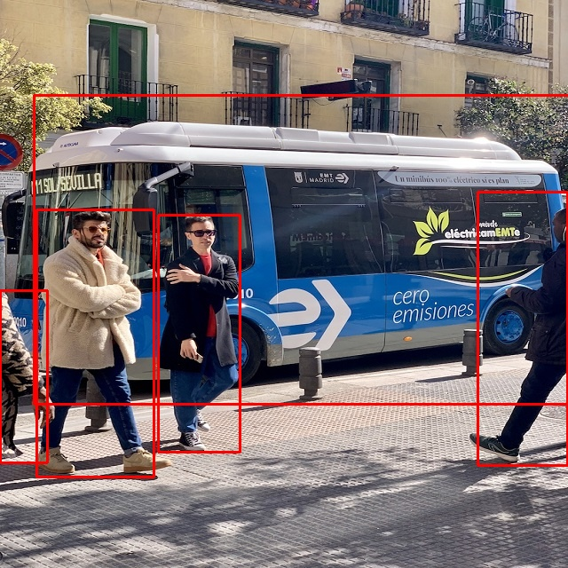
# 板端部署
首先设置环境变量
```bash 
source /home/warren/Ascend/ascend-toolkit/latest/x86_64-linux/bin/setenv.bash
```
## 模型转换
参考《ATC工具使用指南》
量化,yolov5n量化后模型的大小为为3.2M
```bash
atc --model=/home/wzw/00-Ascend/model/yolov5n/changed_model.onnx \
--framework=5 \
--output=/home/wzw/00-Ascend/model/yolov5n/yolov5n_noquat \
--image_list="images:./input.bin"  --input_type="images:FP32" \
```
非量化加上
```bash 
--net_optimize_enable=0 --layer_fusion_enable=0 --layer_m2m_enable=0 --compile_mode=1 \
--weight_quant_per_channel=1 --forward_quantization_option=3 --online_model_type=2
```
yolov5n非量化后模型的大小为为3.6M
调试加上
```bash 
--dump_data=3 --log_level=0 \
--mode=1  --om=/home/wzw/00-Ascend/model/yolov5n/compressed_model.onnx \
--json=/home/wzw/00-Ascend/model/yolov5n/out.json
```
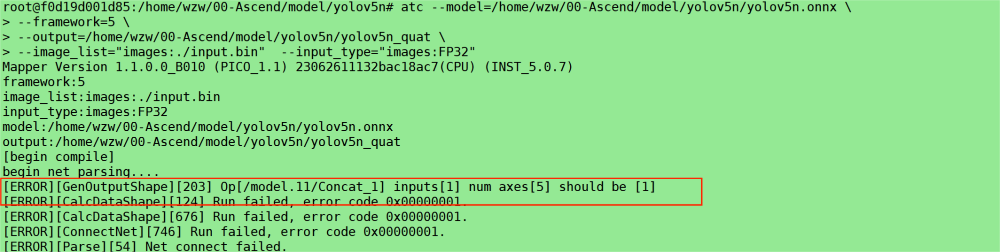
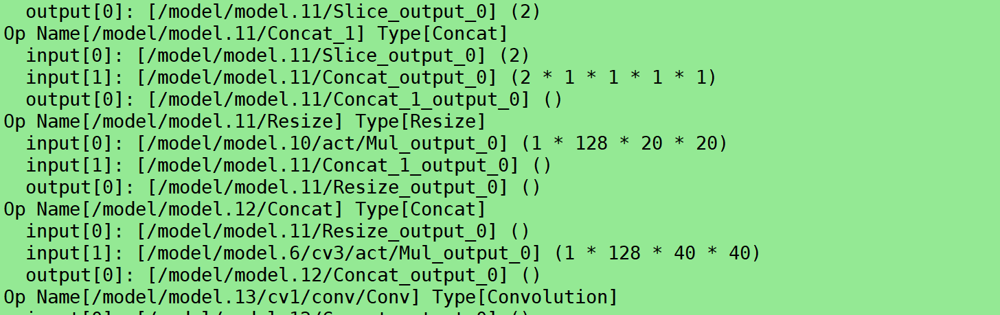
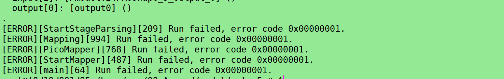
从报错信息可以看出/model.11/Concat_1这个节点的两个输入维度不一样导致了无法concat，参考《ATC工具使用指南》
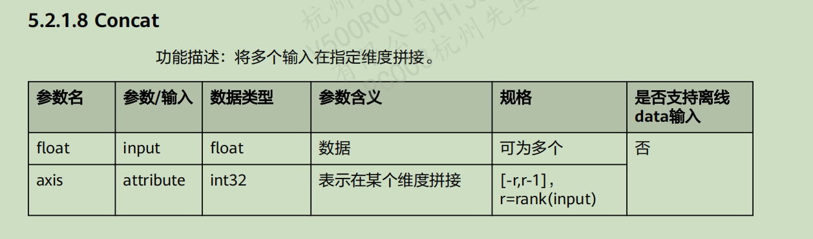
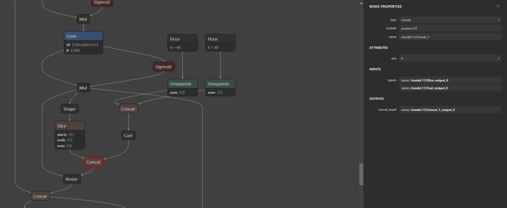
利用netron查看/model.11/Concat_1的两个输入/model.11/Slice_reshaped、/model.11/Cast_output_0分别为[2]、[2,1,1,1,1]，有两种方案，一是将/model.11/Cast_output_0降维成[2],但是最后会报下图错误，后期再研究；
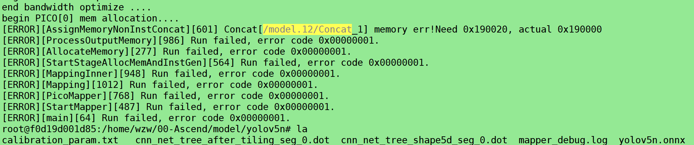
因此采用第二种思路，将/model.11/Slice_reshaped拓展成[2,1,1,1,1]，新建onnx_edit.py：
导入库，定义读取文件；
```python
import os
import sys
os.chdir(sys.path[0])
import onnx
from onnx import helper,shape_inference
ONNXMODEL='yolov5n_self.onnx'
```
加载onnx模型
```python
model = onnx.load(ONNXMODEL)
graph = model.graph
node  = graph.node
```
创建reshape的Constant；
```python 
new_shape = [2, 1, 1, 1, 1]
value=helper.make_tensor('reshape_value', 7, dims=[len(new_shape)], vals=new_shape)
attra=helper.make_attribute("value",value)
shape_node=helper.make_node(
        'Constant',
        inputs=[],
        outputs=['reshape_shape'],
        name='reshape_shape'
)
shape_node.attribute.insert(0,attra)
```
创建Reshape节点，这里的Reshape需要两个值，一个是输入值，一个是需要reshpe成的形状，也就是之前创建的shape_node；
```python 
reshape_node = onnx.helper.make_node(
        "Reshape",
        inputs=['/model.11/Slice_output_0','reshape_shape'],
        outputs=["/model.11/Slice_reshaped"],
        name='/model.11/Slice_reshaped'
)
```
找到'/model.11/Slice'节点的index，再根据index插入Constant和reshape节点
```python
for i,node_ in enumerate(node):
        if node_.name=='/model.11/Slice':
            node.insert(i+1,shape_node)
            node.insert(i+2,reshape_node)
```
此时reshape节点已经成功插入到了'/model.11/Slice'的后边，需要修改Concat节点，因为无法直接编辑Concat节点的输入输出，因此采用替换的方式进行处理；先创建一个新的Concat节点，模型的其中的一个输入要改为reshape节点的输出，另一个输入不用变，输出也保持不变，可以使用netron查看模型结构；
```python
Concat_node=onnx.helper.make_node(
        'Concat',
        inputs=['/model.11/Slice_reshaped','/model.11/Cast_output_0'],
        outputs=['/model.11/Concat_1_output_0'],
        name='/model.11/Concat_1',
        axis=0  
    )
```
将原先的concat节点进行替换
```python
for i in range(len(graph.node)):
        node_ = graph.node[i]
        if node_.name=='/model.11/Concat_1':
            graph.node.remove(node_)
            graph.node.insert(i, Concat_node)
            print("-------------------------------")
```
最后check model并保存模型
```python
onnx.checker.check_model(model)
inferred_model = shape_inference.infer_shapes(model)
onnx.save(model, "changed_model.onnx")
```
netron查看修改的模型，可以看到reshape节点已经成功插入；
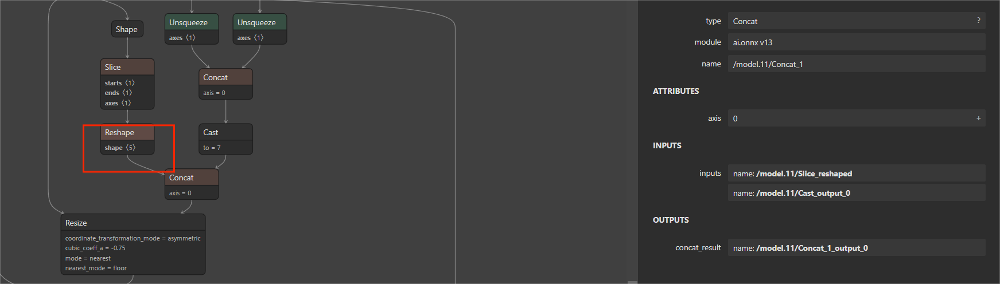
继续转换模型，发现/model.15/Concat_1报错，发现一样的问题，用上述方法继续新增reshape节点即可
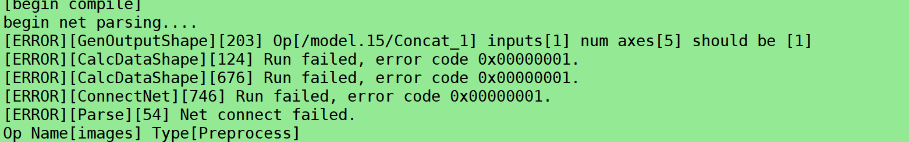
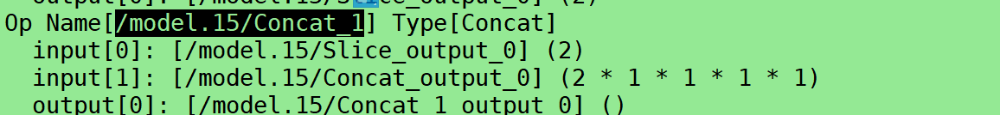
更改后模型转换成功
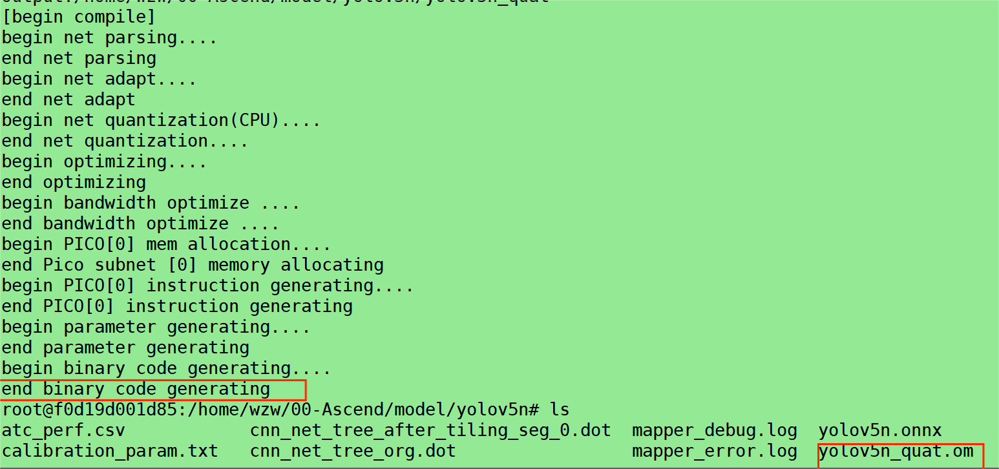
## 推理代码编写
### 部署框架代码逻辑
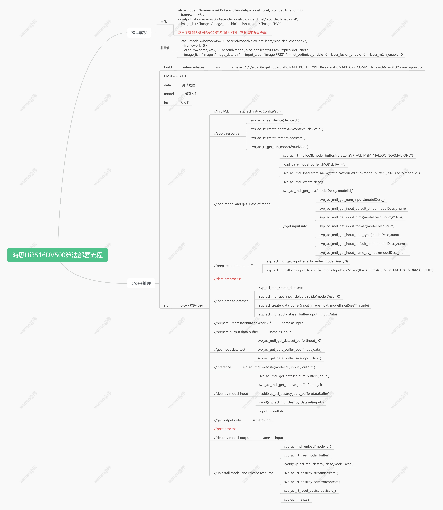
### 编译代码
1：
```bash
mkdir -p build/intermediates/soc
cd build/intermediates/soc
cmake ../../../src -Dtarget=board -DCMAKE_BUILD_TYPE=Release -DCMAKE_CXX_COMPILER=aarch64-v01c01-linux-gnu-gcc
make
```
拷贝至板端运行
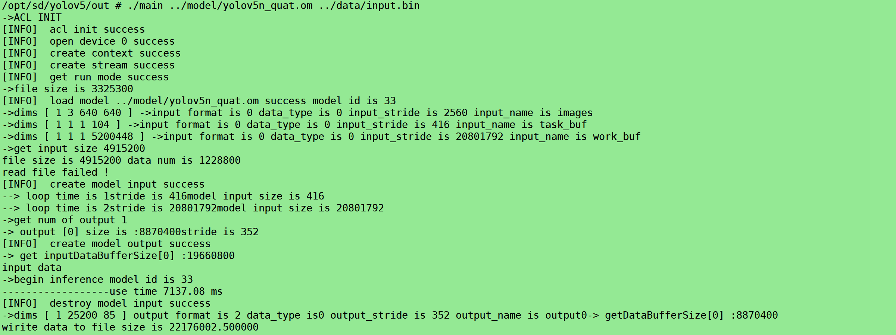
2:查看《应用开发指南》,输出数据为float类型，输出缓冲区字节数为8870400B，stride对齐后为352B也就是88个数据，因此输出格式为[1,25200,88]，将输出拷贝出来保存为output.bin
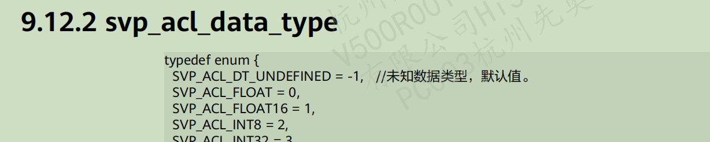
```C++
void WritedDataC(float * Buffer,const char * filename,int size)
{
    FILE * fp=NULL;
    fp=fopen(filename,"w");
    if (fp ==NULL){
        printf("fail to open file !\n");
    }
    fwrite(Buffer,sizeof(float),size,fp);
}
```
3:将output.bin文件拷贝至服务器利用python重新转化为tensor替代onnx的输出进行测试，使用量化模型后，[5:84]的数据均变成了0，因此结果全部丢失，而非量化模型[4:85]结果依然还在，精度还在。量化后丢失的问题待解决（可以查看官方readme）
此时om模型验证完毕，可以编写板端的前后处理代码了；
### 前处理代码
主要就是将图像的像素数据转化为0-1的float类型，并将数据维度调整为（1，3，640，640）
```C++
void PreProcess(float * input_buf)
{
    cv::Mat image = cv::imread("../data/bus.jpg");
    if (image.empty()) {
        std::cerr << "Failed to read image." << std::endl;
    }
    cv::cvtColor(image, image, cv::COLOR_BGR2RGB);
    // 将像素值归一化到 [0, 1] 范围
    cv::Mat input_array;
    image.convertTo(input_array, CV_32FC3, 1.0 / 255.0);

    int rh = input_array.rows;
    int rw = input_array.cols;
    int rc = input_array.channels();
    for (int i = 0; i < rc; ++i) {
        cv::extractChannel(input_array, cv::Mat(rh, rw, CV_32FC1, input_buf + i * rh * rw), i);
    }
}
```
### 后处理代码
1：输出维度为[1，25200，85],其中85的前四个为中心点的x，y以及框的宽和高，第五个为框的置信度，后面80个为类别的置信度（有80个类别）；
2：25200=(80∗80+40∗40+20∗20)∗3，stride为8、16、32，640/8=80,640/16=40,640/32=20
3:筛选多余的框，第一次筛除框置信度<conf-thres,接着删除框置信度*类别置信度<iou-thres
conf-thres=0.25, confidence threshold
iou-thres=0.45, NMS IoU threshold
```C++
float iou(Bbox box1, Bbox box2) {
    /*  
    iou=交并比
    */
    int x1 = max(box1.x, box2.x);
    int y1 = max(box1.y, box2.y);
    int x2 = min(box1.x + box1.w, box2.x + box2.w);
    int y2 = min(box1.y + box1.h, box2.y + box2.h);
    int w = max(0, x2 - x1);
    int h = max(0, y2 - y1);
    float over_area = w * h;
    return over_area / (box1.w * box1.h + box2.w * box2.h - over_area);
}

bool judge_in_lst(int index, vector<int> index_lst) {
    //若index在列表index_lst中则返回true，否则返回false
    if (index_lst.size() > 0) {
        for (int i = 0; i < int(index_lst.size()); i++) {
            if (index == index_lst.at(i)) {
                return true;
            }
        }
    }
    return false;
}

int get_max_index(vector<Detection> pre_detection) {
    //返回最大置信度值对应的索引值
    int index;
    float conf;
    if (pre_detection.size() > 0) {
        index = 0;
        conf = pre_detection.at(0).conf;
        for (int i = 0; i < int(pre_detection.size()); i++) {
            if (conf < pre_detection.at(i).conf) {
                index = i;
                conf = pre_detection.at(i).conf;
            }
        }
        return index;
    }
    else {
        return -1;
    }
}

vector<int> nms(vector<Detection> pre_detection, float iou_thr)
{
    /*
    返回需保存box的pre_detection对应位置索引值
    */
    int index;
    vector<Detection> pre_detection_new;
    //Detection det_best;
    Bbox box_best, box;
    float iou_value;
    vector<int> keep_index;
    vector<int> del_index;
    bool keep_bool;
    bool del_bool;

    if (pre_detection.size() > 0) {
        pre_detection_new.clear();
        // 循环将预测结果建立索引
        for (int i = 0; i < int(pre_detection.size()); i++) {
            pre_detection.at(i).index = i;
            pre_detection_new.push_back(pre_detection.at(i));
        }
        //循环遍历获得保留box位置索引-相对输入pre_detection位置
        while (pre_detection_new.size() > 0) {
            index = get_max_index(pre_detection_new);
            if (index >= 0) {
                keep_index.push_back(pre_detection_new.at(index).index); //保留索引位置

                // 更新最佳保留box
                box_best.x = pre_detection_new.at(index).bbox[0];
                box_best.y = pre_detection_new.at(index).bbox[1];
                box_best.w = pre_detection_new.at(index).bbox[2];
                box_best.h = pre_detection_new.at(index).bbox[3];

                for (int j = 0; j < int(pre_detection.size()); j++) {
                    keep_bool = judge_in_lst(pre_detection.at(j).index, keep_index);
                    del_bool = judge_in_lst(pre_detection.at(j).index, del_index);
                    if ((!keep_bool) && (!del_bool)) { //不在keep_index与del_index才计算iou
                        box.x = pre_detection.at(j).bbox[0];
                        box.y = pre_detection.at(j).bbox[1];
                        box.w = pre_detection.at(j).bbox[2];
                        box.h = pre_detection.at(j).bbox[3];
                        iou_value = iou(box_best, box);
                        if (iou_value > iou_thr) {
                            del_index.push_back(j); //记录大于阈值将删除对应的位置
                        }
                    }

                }
                //更新pre_detection_new
                pre_detection_new.clear();
                for (int j = 0; j < int(pre_detection.size()); j++) {
                    keep_bool = judge_in_lst(pre_detection.at(j).index, keep_index);
                    del_bool = judge_in_lst(pre_detection.at(j).index, del_index);
                    if ((!keep_bool) && (!del_bool)) {
                        pre_detection_new.push_back(pre_detection.at(j));
                    }
                }
            }
        }
    }

    del_index.clear();
    del_index.shrink_to_fit();
    pre_detection_new.clear();
    pre_detection_new.shrink_to_fit();

    return  keep_index;

}


vector<Detection> PostProcess(float* prob,float conf_thr=0.3,float nms_thr=0.5)
{
    vector<Detection> pre_results;
    vector<int> nms_keep_index;
    vector<Detection> results;
    bool keep_bool;
    Detection pre_res;
    float conf;
    int tmp_idx;
    float tmp_cls_score;
    for (int i = 0; i < 25200; i++) {
        tmp_idx = i * (CLSNUM + 5);
        pre_res.bbox[0] = prob[tmp_idx + 0];  //cx
        pre_res.bbox[1] = prob[tmp_idx + 1];  //cy
        pre_res.bbox[2] = prob[tmp_idx + 2];  //w
        pre_res.bbox[3] = prob[tmp_idx + 3];  //h
        conf = prob[tmp_idx + 4];  // 是为目标的置信度
        tmp_cls_score = prob[tmp_idx + 5] * conf; //conf_thr*nms_thr
        pre_res.class_id = 0;
        pre_res.conf = 0;
        // 这个过程相当于从除了前面5列，在后面的cla_num个数据中找出score最大的值作为pre_res.conf，对应的列作为类id
        for (int j = 1; j < CLSNUM; j++) {     
            tmp_idx = i * (CLSNUM + 5) + 5 + j; //获得对应类别索引
            if (tmp_cls_score < prob[tmp_idx] * conf){
                tmp_cls_score = prob[tmp_idx] * conf;
                pre_res.class_id = j;
                pre_res.conf = tmp_cls_score;
            }
        }
        if (conf >= conf_thr) {
            pre_results.push_back(pre_res);
        }
    }
    //使用nms，返回对应结果的索引
    nms_keep_index=nms(pre_results,nms_thr);
    // 根据nms找到的索引，将结果取出来作为最终结果
    for (int i = 0; i < int(pre_results.size()); i++) {
        keep_bool = judge_in_lst(i, nms_keep_index);
        if (keep_bool) {
            results.push_back(pre_results.at(i));
        }
    }

    pre_results.clear();
    pre_results.shrink_to_fit();
    nms_keep_index.clear();
    nms_keep_index.shrink_to_fit();

    return results; 
}
```
结果
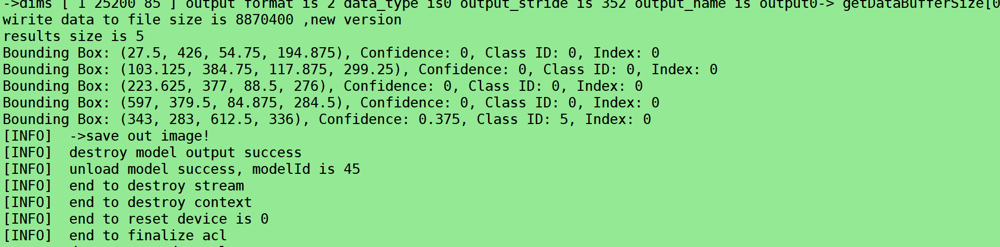
这里注意得到的结果时[center_x,center_y,w,h]也就是中心点坐标和宽高，需要将其转化为框的四个角的坐标
```C++
        float cx=detection.bbox[0];
        float cy=detection.bbox[1];
        float w=detection.bbox[2];
        float h=detection.bbox[3];
        box_point.push_back(cv::Point(cx+w/2,cy-h/2));  // 右上角
        box_point.push_back(cv::Point(cx-w/2,cy-h/2));  // 左上角
        box_point.push_back(cv::Point(cx-w/2,cy+h/2));  // 左下角  
        box_point.push_back(cv::Point(cx+w/2,cy+h/2));  // 右下角 
```
## 结果展示
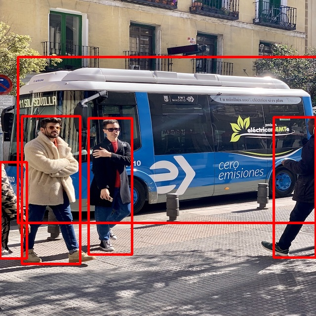

## 优化加速
参考《Profiling工具使用指南》
可以看出单张推理的时间很长接近7s，这是因为使用到了cpu算子，cpu算子算力远弱于npu，并且还有数据搬运的时间我们需要对其进行加速，即将cpu算子全部调整为npu算子
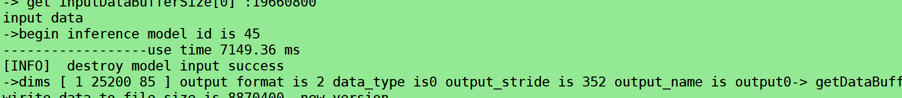
为了导出模型推理时的相关信息，在转换om模型时需加入--online_model_type=2 选项，同时修改acl.json文件。加入profile
```bash 
{
    "dump": {
        "dump_list": [
            {
                "model_name": "resnet50"
            }
        ],
        "dump_mode": "output",
        "dump_path": "./"
    }
    ,
    "profiler": {
        "switch": "on",
        "output": "output",
        "interval": "0",
        "aic_metrics": "ArithmeticUtilization",
        "aicpu": "on",
        "acl_api": "on"
        }
}
```
推理时可以发现模型推理相关信息已dump
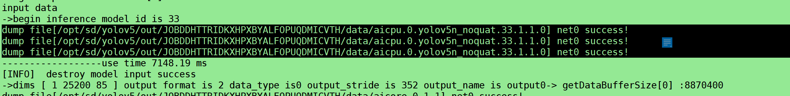
将生成的文件拷贝到pc端，利用提供的脚本工具对生成的信息进行转化/usr/local/Ascend/ascend
toolkit/svp_latest/toolkit/tools/profiler/profiler_tool/analysis/msprof/msprof.py
msprof import -dir xxx 
msprof export summary -dir xxx 
msprof export timeline -dir xxx 
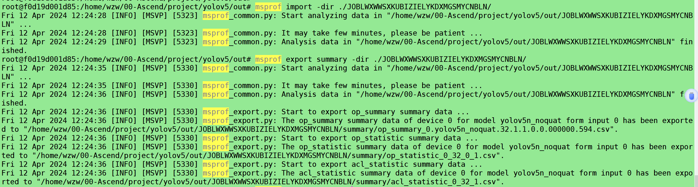
得到如下文件，需要summary和timeline文件
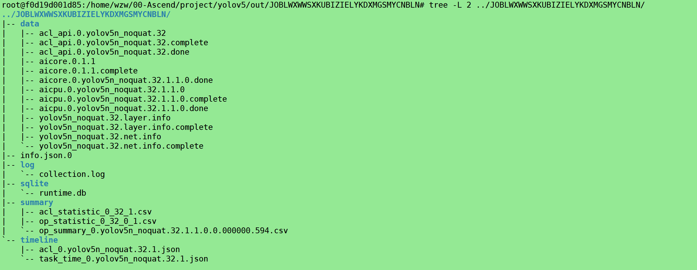
打开google chrome浏览器，搜索chrome://tracing/，load task_time_0.yolov5n_noquat.32.1.json文件，可以看到如下两个阶段使用的都是cpu算子，耗时过长
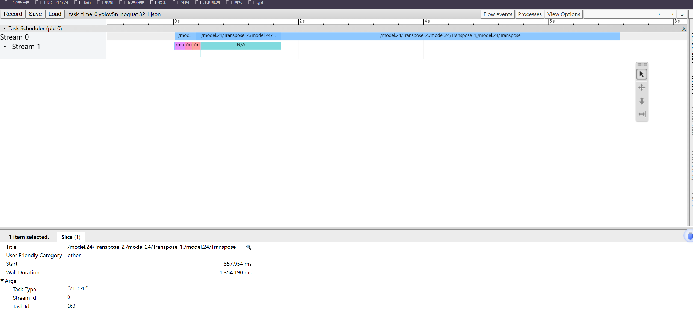
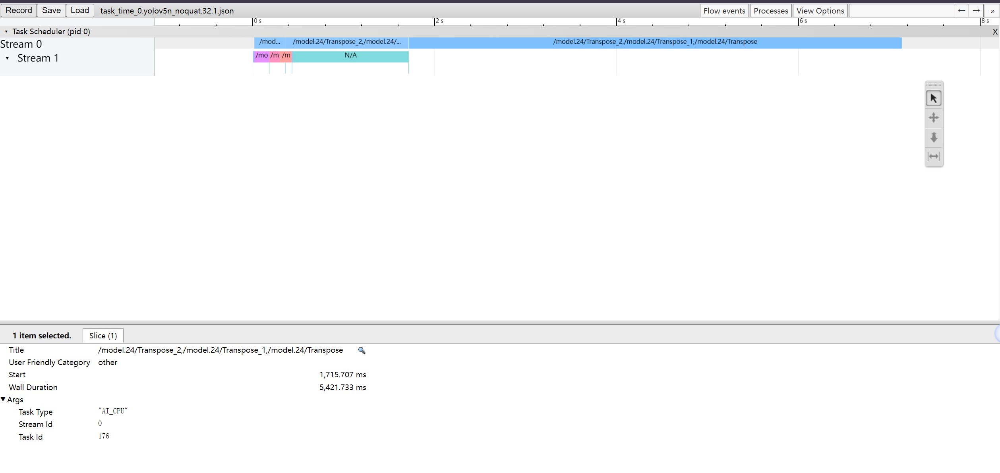