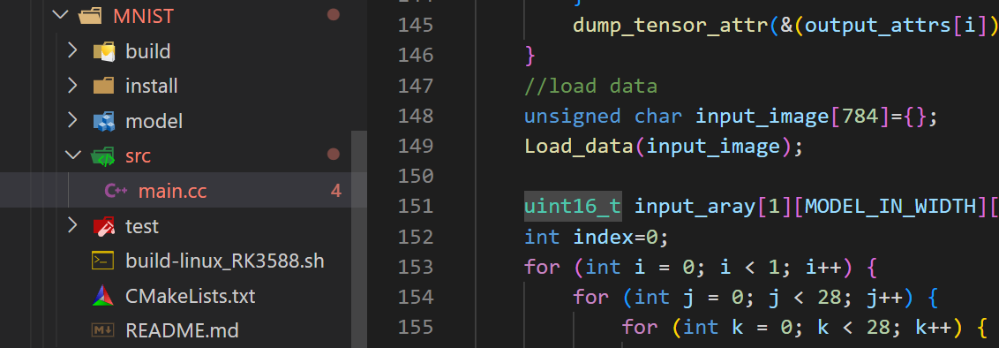

# 大致流程

# 首先搭建好rknn_toolkit环境
[（手把手）rknn-toolkit以及rknpu_sdk环境搭建--以rk3588为例](http://t.csdnimg.cn/RpGhd)
# 转化为rknn模型
1：进入docker
```bash
sudo docker run -t -i --privileged -v /dev/bus/usb:/dev/bus/usb \
 -v /home/warren/RK_NPU_SDK_1.3.0/rknn-toolkit2-1.3.0/examples:/rknn_toolkit \
 rknn-toolkit2:1.3.0-cp36 /bin/bash
 ```
3:复制一个resnet50v2并命名为MNIST

4：准备好如下文件

6：转换代码
```python
import os
import urllib
import traceback
import time
import sys
import numpy as np
import cv2
from rknn.api import RKNN

ONNX_MODEL = 'model.onnx'
RKNN_MODEL = 'model.rknn'

if __name__ == '__main__':

    # Create RKNN object
    rknn = RKNN()

    # pre-process config
    print('--> Config model')
    rknn.config(target_platform='rk3588')
    print('done')

    # Load ONNX model
    print('--> Loading model')
    ret = rknn.load_onnx(model=ONNX_MODEL)
    if ret != 0:
        print('Load model failed!')
        exit(ret)
    print('done')

    # Build model
    print('--> Building model')
    ret = rknn.build(do_quantization=False)
    if ret != 0:
        print('Build model failed!')
        exit(ret)
    print('done')

    # Export RKNN model
    print('--> Export RKNN model')
    ret = rknn.export_rknn(RKNN_MODEL)
    if ret != 0:
        print('Export resnet50v2.rknn failed!')
        exit(ret)
    print('done')

    # Set inputs
    with open("./data/MNIST/raw/train-images-idx3-ubyte","rb") as f:
        file=f.read()
        num=100
        i = 16+784*num
        image1 = [int(str(item).encode('ascii'),16) for item in file[i:i+784]]
        input_data = np.array(image1,dtype=np.float32).reshape(1,28,28,1)
    #save the image
    image1_np = np.array(image1,dtype=np.uint8).reshape(28,28,1)
    file_name = "test.jpg"
    cv2.imwrite(file_name,image1_np)

    # init runtime environment
    print('--> Init runtime environment')
    ret = rknn.init_runtime()
    if ret != 0:
        print('Init runtime environment failed')
        exit(ret)
    print('done')

    # Inference
    print('--> Running model')
    outputs = rknn.inference(inputs=input_data)
    x = outputs[0]
    output = np.exp(x)/np.sum(np.exp(x))
    outputs = np.argmax([output])
    print("----------outputs----------",outputs)
    print('done')

    rknn.release()
```
7：python test.py

8:生成后目录结构

# 板端部署
目录结构

build-linux_RK3588.sh
```bash
#!/bin/bash
set -e

TARGET_SOC="rk3588"

export TOOL_CHAIN=/home/warren/Downloads/gcc-buildroot-9.3.0-2020.03-x86_64_aarch64-rockchip-linux-gnu
# for aarch64
GCC_COMPILER=/home/warren/Downloads/gcc-buildroot-9.3.0-2020.03-x86_64_aarch64-rockchip-linux-gnu/bin/aarch64-rockchip-linux-gnu

export LD_LIBRARY_PATH=${TOOL_CHAIN}/lib64:$LD_LIBRARY_PATH
export CC=${GCC_COMPILER}-gcc
export CXX=${GCC_COMPILER}-g++
ROOT_PWD=$( cd "$( dirname $0 )" && cd -P "$( dirname "$SOURCE" )" && pwd )

# build
BUILD_DIR=${ROOT_PWD}/build/build_linux_aarch64

if [[ ! -d "${BUILD_DIR}" ]]; then
  mkdir -p ${BUILD_DIR}
fi

cd ${BUILD_DIR}
cmake ../.. \
    -DTARGET_SOC=${TARGET_SOC} \
    -DCMAKE_C_COMPILER=${GCC_COMPILER}-gcc \
    -DCMAKE_CXX_COMPILER=${GCC_COMPILER}-g++
make -j4
make install
cd -
```
main.cc
```c
/*-------------------------------------------
                Includes
-------------------------------------------*/
#include <stdio.h>
#include <stdint.h>
#include <stdlib.h>
#include <fstream>
#include <iostream>
#include <sys/time.h>

#include "opencv2/core/core.hpp"
#include "opencv2/imgproc.hpp"
#include "opencv2/imgcodecs.hpp"
#include "rknn_api.h"

using namespace std;
using namespace cv;

const int MODEL_IN_WIDTH = 28;
const int MODEL_IN_HEIGHT = 28;
const int MODEL_CHANNEL = 1;

int ret=0;
int loop_count=8000;

/*-------------------------------------------
                  Functions
-------------------------------------------*/
static inline int64_t getCurrentTimeUs()
{
    struct timeval tv;
    gettimeofday(&tv, NULL);
    return tv.tv_sec * 1000000 + tv.tv_usec;
}
static void dump_tensor_attr(rknn_tensor_attr* attr)  //dump tensor message
{
  printf("  index=%d, name=%s, n_dims=%d, dims=[%d, %d, %d, %d], n_elems=%d, size=%d, fmt=%s, type=%s, qnt_type=%s, "
         "zp=%d, scale=%f\n",
         attr->index, attr->name, attr->n_dims, attr->dims[0], attr->dims[1], attr->dims[2], attr->dims[3],
         attr->n_elems, attr->size, get_format_string(attr->fmt), get_type_string(attr->type),
         get_qnt_type_string(attr->qnt_type), attr->zp, attr->scale);
}

static unsigned char *load_model(const char *filename, int *model_size) //load model
{
    FILE *fp = fopen(filename, "rb");
    if(fp == nullptr) {
        printf("fopen %s fail!\n", filename);
        return NULL;
    }
    fseek(fp, 0, SEEK_END);
    int model_len = ftell(fp);
    unsigned char *model = (unsigned char*)malloc(model_len);
    fseek(fp, 0, SEEK_SET);
    if(model_len != fread(model, 1, model_len, fp)) {
        printf("fread %s fail!\n", filename);
        free(model);
        return NULL;
    }
    *model_size = model_len;
    if(fp) {
        fclose(fp);
    }
    return model;
}

void Bubble_sort(float *buffer)
{
    float temp=0;
    for(int i = 0; i < 10; i++){
        for(int j=0;j<10-i-1;j++){
            if(buffer[j]>buffer[j+1]){
                temp=buffer[j];
                buffer[j]=buffer[j+1];
                buffer[j+1]=temp;
            }
        }
    }
}

void Load_data(int num,unsigned char * input_image)
{
    int j=16+784*num;
    FILE *file = fopen("./model/data/MNIST/raw/train-images-idx3-ubyte", "rb");
    if (file == NULL) {
        printf("can't open the file!\n");
    }
    fseek(file,j,SEEK_SET);
    fread(input_image,sizeof(char),784,file);
/*      for(int i=0;i<MODEL_IN_WIDTH;i++){
        for(int j=0;j<MODEL_IN_WIDTH;j++){
            printf("%4d",input_image[i*28+j]);
        }
        printf("\n");
    }  */
    fclose(file);
}

void Array_change(float input_aray[1][MODEL_IN_WIDTH][MODEL_IN_HEIGHT][MODEL_CHANNEL],unsigned char *input_image)
{
   int index=0;
    for (int i = 0; i < 1; i++) {
        for (int j = 0; j < MODEL_IN_WIDTH; j++) {
            for (int k = 0; k < MODEL_IN_HEIGHT; k++) {
                for (int l = 0; l < MODEL_CHANNEL; l++) {
                    input_aray[i][j][k][l] = (float)input_image[index++];
                    if(input_aray[i][j][k][l]==0){
                    }
                }
            }

        }

    } 
}
void print_Array(int num,float *buffer)
{
    for(int i =0;i<num;i++){
        printf("%f\n",buffer[i]);
    }
}

void get_tensor_message(rknn_context ctx,rknn_tensor_attr *attrs,uint32_t num,int io)
{
    for (int i = 0; i < num; i++) {
        attrs[i].index = i;
        if(io==1){
        ret = rknn_query(ctx, RKNN_QUERY_INPUT_ATTR, &(attrs[i]), sizeof(rknn_tensor_attr));
        }
        else{
            ret = rknn_query(ctx, RKNN_QUERY_OUTPUT_ATTR, &(attrs[i]), sizeof(rknn_tensor_attr));
        }
        if (ret != RKNN_SUCC) {
            printf("rknn_query fail! ret=%d\n", ret);
        }
        dump_tensor_attr(&(attrs[i]));
    }
}
/*-------------------------------------------
                  Main Function
-------------------------------------------*/
int main(int argc, char** argv)
{
    int64_t time_sum[loop_count]={};
    int64_t sum=0;
    int num =-1;
       
    rknn_context ctx;
    int model_len = 0;
    unsigned char *model;
    rknn_output outputs[1];
    rknn_input inputs[1];
    const char *model_path = argv[1];
    if (argc != 2)
    {
        printf("Usage: %s <rknn model>  \n", argv[0]);
        return -1;
    }
    // Load RKNN Model
    printf("-------------load rknn model\n");
    model = load_model(model_path, &model_len);
    ret = rknn_init(&ctx, model, model_len, RKNN_FLAG_COLLECT_PERF_MASK, NULL);
    //ret = rknn_init(&ctx, model, model_len, 0, NULL);
    if(ret < 0) {
        printf("rknn_init fail! ret=%d\n", ret);
        return -1;
    }
    printf("--------------done\n");

    // Get Model Input and Output Info
    rknn_input_output_num io_num;
    ret = rknn_query(ctx, RKNN_QUERY_IN_OUT_NUM, &io_num, sizeof(io_num));
    if (ret != RKNN_SUCC) {
        printf("rknn_query fail! ret=%d\n", ret);
        return -1;
    }
    printf("model input num: %d, output num: %d\n", io_num.n_input, io_num.n_output);
    //get input tensor message
    printf("input tensors:\n");
    rknn_tensor_attr input_attrs[io_num.n_input];
    memset(input_attrs, 0, sizeof(input_attrs));
    get_tensor_message(ctx,input_attrs,io_num.n_input,1);
    
    //get output tensor message
    printf("output tensors:\n");
    rknn_tensor_attr output_attrs[io_num.n_output];
    memset(output_attrs, 0, sizeof(output_attrs));
    get_tensor_message(ctx,output_attrs,io_num.n_output,0);
    for(int i=0;i<loop_count;i++){
        num++;
        printf("-------------------------------------loop %d \n",i);
        //load data
        unsigned char input_image[784]={};
        float input_aray[1][MODEL_IN_WIDTH][MODEL_IN_HEIGHT][MODEL_CHANNEL]={};
        Load_data(num,input_image);
        Array_change(input_aray,input_image);

        // Set Input Data
        memset(inputs, 0, sizeof(inputs));
        inputs[0].index = 0;
        inputs[0].type = RKNN_TENSOR_FLOAT32;
        inputs[0].size = 28*28*4;
        inputs[0].fmt = RKNN_TENSOR_NHWC;
        inputs[0].buf = input_aray;
        ret = rknn_inputs_set(ctx, 1, inputs);
        if(ret < 0) {
            printf("rknn_input_set fail! ret=%d\n", ret);
            return -1;
        }

        // Run
        printf("--------------rknn_run\n");
        int64_t start_us = getCurrentTimeUs();
        ret = rknn_run(ctx, nullptr);
        if(ret < 0) {
            printf("rknn_run fail! ret=%d\n", ret);
            return -1;
        }
        time_sum[i] = getCurrentTimeUs() - start_us;
        sum = sum+time_sum[i];
        printf(": Elapse Time = %.2fms sum %.2f \n", time_sum[i] / 1000.f,sum / 1000.f);

/*         _rknn_perf_detail perf_run_detail;
        ret = rknn_query(ctx, RKNN_QUERY_PERF_DETAIL, &perf_run_detail, sizeof(perf_run_detail));
        printf("---------the detail of time is %s %d\n",perf_run_detail.perf_data,perf_run_detail.data_len);
        rknn_perf_run perf_run;
        ret = rknn_query(ctx, RKNN_QUERY_PERF_RUN, &perf_run, sizeof(perf_run));
        printf("---------the sum of time is %d us\n",perf_run.run_duration);  */

        // Get Output
        memset(outputs, 0, sizeof(outputs));
        outputs[0].want_float = 1;
        ret = rknn_outputs_get(ctx, 1, outputs, NULL);
        if(ret < 0) {
            printf("rknn_outputs_get fail! ret=%d\n", ret);
            return -1;
        }

        // Post Process
        float *buffer = (float *)outputs[0].buf;
        float buffer_copy[]={};
        for(int i=0;i<10;i++){
            buffer_copy[i]=buffer[i];      
        }
        Bubble_sort(buffer);
        for(int i =0;i<10;i++){
            if(buffer_copy[i]==buffer[9]){
                printf("----------the pic value is %d \n",i);
            }
        }
        
    }
    // Release rknn_outputs
    ret=rknn_outputs_release(ctx, 1, outputs);
    if(ret < 0) {
        printf("rknn_outputs_release fail! ret=%d\n", ret);
        return -1;
    }
    printf("--------- loop time : %d average time is %.2f ms\n",loop_count,(sum / 1000.f)/loop_count);
    // Release
    if(ctx >= 0) {
        rknn_destroy(ctx);
    }
    if(model) {
        free(model);
    }
     

    return 0;
}
```
# 结果打印


sudo cat /sys/kernel/debug/rknpu/load 查看npu利用率
uint8

fp16
