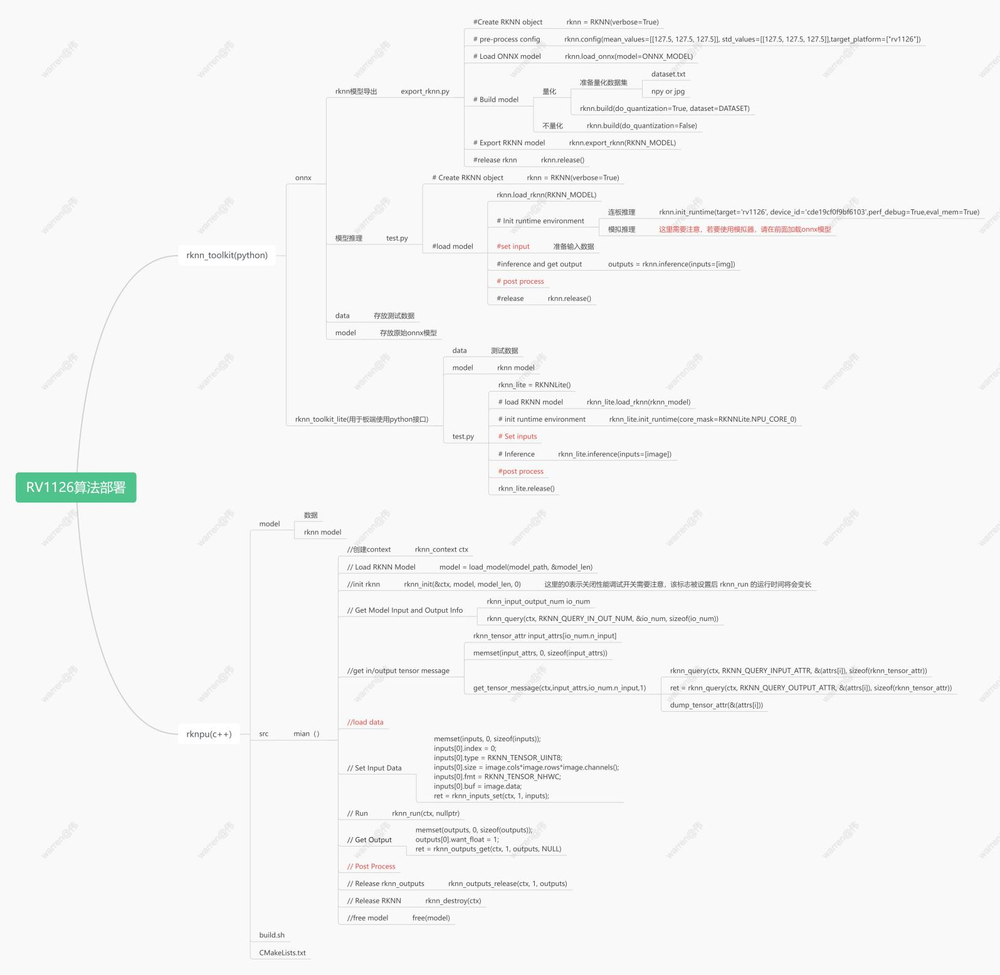
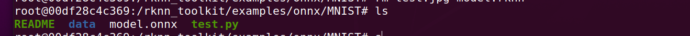
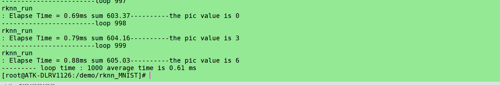

# RV1126算法部署大致流程

## 环境搭建
[rknn_toolkit以及rknpu环境搭建-rv1126](http://t.csdnimg.cn/2ujQV)
## 导出rknn文件
1.进入docker
docker run -t -i --privileged -v /dev/bus/usb:/de/bus/usb  \
-v /home/wzw/rk_npu_sdk/rknn-toolkit-master-v1.7.3:/rknn_toolkit rknn-toolkit:1.7.3 /bin/bash
2.进入/rknn_toolkit/examples/onnx，复制一个resnet50v2并命名为MNIST

3.准备以下文件

4.python test.py
```python
import os
import urllib
import traceback
import time
import sys
import numpy as np
import cv2
from rknn.api import RKNN

ONNX_MODEL = 'model.onnx'
RKNN_MODEL = 'model.rknn'

if __name__ == '__main__':

    # Create RKNN object
    rknn = RKNN()

    # pre-process config
    print('--> Config model')
    rknn.config(target_platform=["rv1126"])
    print('done')

    # Load ONNX model
    print('--> Loading model')
    ret = rknn.load_onnx(model=ONNX_MODEL,
                         inputs=['input.1'],
                         input_size_list=[[1,28,28]],
                         outputs=['25'])
    if ret != 0:
        print('Load model failed!')
        exit(ret)
    print('done')

    # Build model
    print('--> Building model')
    ret = rknn.build(do_quantization=False)
    if ret != 0:
        print('Build model failed!')
        exit(ret)
    print('done')

    # Export RKNN model
    print('--> Export RKNN model')
    ret = rknn.export_rknn(RKNN_MODEL)
    if ret != 0:
        print('Export resnet50v2.rknn failed!')
        exit(ret)
    print('done')

    # Set inputs
    with open("./data/MNIST/raw/train-images-idx3-ubyte","rb") as f:
        file=f.read()
        num=100
        i = 16+784*num
        image1 = [int(str(item).encode('ascii'),16) for item in file[i:i+784]]
        input_data = np.array(image1,dtype=np.float32).reshape(1,1,28,28)
    #save the image
    image1_np = np.array(image1,dtype=np.uint8).reshape(28,28,1)
    file_name = "test.jpg"
    cv2.imwrite(file_name,image1_np)

    # init runtime environment
    print('--> Init runtime environment')
    ret = rknn.init_runtime()
    if ret != 0:
        print('Init runtime environment failed')
        exit(ret)
    print('done')

    # Inference
    print('--> Running model')
    outputs = rknn.inference(inputs=input_data)
    x = outputs[0]
    output = np.exp(x)/np.sum(np.exp(x))
    outputs = np.argmax([output])
    print("----------outputs----------",outputs)
    print('done')

    rknn.release()
```
结果

生成rknn文件

## 板端部署
复制一个mobilenet并命名为MNIST目录结构为

将toolkit生成的rknn模型文件拷贝至model
build.sh
```bash
#!/bin/bash

set -e

# for rk1808 aarch64
# GCC_COMPILER=${RK1808_TOOL_CHAIN}/bin/aarch64-linux-gnu

# for rk1806 armhf
# GCC_COMPILER=~/opts/gcc-linaro-6.3.1-2017.05-x86_64_arm-linux-gnueabihf/bin/arm-linux-gnueabihf

# for rv1109/rv1126 armhf
GCC_COMPILER=/opt/atk-dlrv1126-toolchain/bin/arm-linux-gnueabihf

ROOT_PWD=$( cd "$( dirname $0 )" && cd -P "$( dirname "$SOURCE" )" && pwd )

# build rockx
BUILD_DIR=${ROOT_PWD}/build

if [[ ! -d "${BUILD_DIR}" ]]; then
  mkdir -p ${BUILD_DIR}
fi

cd ${BUILD_DIR}
cmake .. \
    -DCMAKE_C_COMPILER=${GCC_COMPILER}-gcc \
    -DCMAKE_CXX_COMPILER=${GCC_COMPILER}-g++
make -j4
make install
cd -
```
main.cc
```c
/*-------------------------------------------
                Includes
-------------------------------------------*/
#include <stdio.h>
#include <stdint.h>
#include <stdlib.h>
#include <fstream>
#include <iostream>
#include <sys/time.h>

#define STB_IMAGE_IMPLEMENTATION
#include "stb/stb_image.h"
#define STB_IMAGE_RESIZE_IMPLEMENTATION
#include <stb/stb_image_resize.h>

#include "rknn_api.h"

using namespace std;

const int MODEL_IN_WIDTH = 28;
const int MODEL_IN_HEIGHT = 28;
const int MODEL_CHANNEL = 1;
int ret =0;
int loop_count = 1000;

/*-------------------------------------------
                  Functions
-------------------------------------------*/
static inline int64_t getCurrentTimeUs()
{
    struct timeval tv;
    gettimeofday(&tv, NULL);
    return tv.tv_sec * 1000000 + tv.tv_usec;
}

static void printRKNNTensor(rknn_tensor_attr *attr)
{
    printf("index=%d name=%s n_dims=%d dims=[%d %d %d %d] n_elems=%d size=%d fmt=%d type=%d qnt_type=%d fl=%d zp=%d scale=%f\n",
           attr->index, attr->name, attr->n_dims, attr->dims[3], attr->dims[2], attr->dims[1], attr->dims[0],
           attr->n_elems, attr->size, 0, attr->type, attr->qnt_type, attr->fl, attr->zp, attr->scale);
}

static unsigned char *load_model(const char *filename, int *model_size)
{
    FILE *fp = fopen(filename, "rb");
    if (fp == nullptr)
    {
        printf("fopen %s fail!\n", filename);
        return NULL;
    }
    fseek(fp, 0, SEEK_END);
    int model_len = ftell(fp);
    unsigned char *model = (unsigned char *)malloc(model_len);
    fseek(fp, 0, SEEK_SET);
    if (model_len != fread(model, 1, model_len, fp))
    {
        printf("fread %s fail!\n", filename);
        free(model);
        return NULL;
    }
    *model_size = model_len;
    if (fp)
    {
        fclose(fp);
    }
    return model;
}

void Load_data(int num,unsigned char * input_image)
{
    int j=16+784*num;
    FILE *file = fopen("./model/data/MNIST/raw/train-images-idx3-ubyte", "rb");
    if (file == NULL) {
        printf("can't open the file!\n");
    }
    fseek(file,j,SEEK_SET);
    fread(input_image,sizeof(char),784,file);
    /* for(int i=0;i<MODEL_IN_WIDTH;i++){
        for(int j=0;j<MODEL_IN_WIDTH;j++){
            printf("%4d",input_image[i*28+j]);
        }
        printf("\n");
    } */
    fclose(file);
}

void Array_change(float input_aray[][MODEL_CHANNEL][MODEL_IN_WIDTH][MODEL_IN_HEIGHT],unsigned char *input_image)
{
   int index=0;
    for (int i = 0; i < 1; i++) {
        for (int j = 0; j < MODEL_CHANNEL; j++) {
            for (int k = 0; k < MODEL_IN_HEIGHT; k++) {
                for (int l = 0; l < MODEL_IN_WIDTH; l++) {
                    input_aray[i][j][k][l] = (float)input_image[index++];
                    //printf("%d ", input_aray[i][j][k][l]);
                    if(input_aray[i][j][k][l]==0){
                        //printf(" ");
                    }
                }
                //printf("\n");
            }
        }
         //printf("\n");
    } 
}

void Bubble_sort(float *buffer)
{
    float temp=0;
    for(int i = 0; i < 10; i++){
        for(int j=0;j<10-i-1;j++){
            if(buffer[j]>buffer[j+1]){
                temp=buffer[j];
                buffer[j]=buffer[j+1];
                buffer[j+1]=temp;
            }
        }
    }
}

void get_tensor_message(rknn_context ctx,rknn_tensor_attr *attrs,uint32_t num,int io)
{
    for (int i = 0; i < num; i++) {
        attrs[i].index = i;
        if(io==1){
        ret = rknn_query(ctx, RKNN_QUERY_INPUT_ATTR, &(attrs[i]), sizeof(rknn_tensor_attr));
        }
        else{
            ret = rknn_query(ctx, RKNN_QUERY_OUTPUT_ATTR, &(attrs[i]), sizeof(rknn_tensor_attr));
        }
        if (ret != RKNN_SUCC) {
            printf("rknn_query fail! ret=%d\n", ret);
        }
        printRKNNTensor(&(attrs[i]));
    }
}
void print_Array(int num,float *buffer)
{
    for(int i =0;i<num;i++){
        printf("%f\n",buffer[i]);
    }
}
/*-------------------------------------------
                  Main Function
-------------------------------------------*/
int main(int argc, char **argv)
{
    rknn_context ctx;
    int model_len = 0;
    unsigned char *model;
    int num=-1;
    int64_t time[1000]={};
    int64_t sum=0;

    const char *model_path = "./model/model.rknn";

    // Load RKNN Model
    model = load_model(model_path, &model_len);

    ret = rknn_init(&ctx, model, model_len, 0);
    if (ret < 0)
    {
        printf("rknn_init fail! ret=%d\n", ret);
        return -1;
    }

    // Get Model Input Output Info
    rknn_input_output_num io_num;
    ret = rknn_query(ctx, RKNN_QUERY_IN_OUT_NUM, &io_num, sizeof(io_num));
    if (ret != RKNN_SUCC)
    {
        printf("rknn_query fail! ret=%d\n", ret);
        return -1;
    }
    printf("model input num: %d, output num: %d\n", io_num.n_input, io_num.n_output);

    printf("input tensors:\n");
    rknn_tensor_attr input_attrs[io_num.n_input];
    memset(input_attrs, 0, sizeof(input_attrs));
    get_tensor_message(ctx,input_attrs,io_num.n_input,1);

    printf("output tensors:\n");
    rknn_tensor_attr output_attrs[io_num.n_output];
    memset(output_attrs, 0, sizeof(output_attrs));
    get_tensor_message(ctx,output_attrs,io_num.n_output,0);

    for(int i=0;i<loop_count;i++){
        printf("------------------------loop %d\n",i);
        // Load image
        unsigned char input_image[784]={};
        float input_aray[1][MODEL_CHANNEL][MODEL_IN_HEIGHT][MODEL_IN_WIDTH]={};
        num++;
        Load_data(num,input_image);
        Array_change(input_aray,input_image);
        // Set Input Data
        rknn_input inputs[1];
        memset(inputs, 0, sizeof(inputs));
        inputs[0].index = 0;
        inputs[0].type = RKNN_TENSOR_FLOAT32;
        inputs[0].size = input_attrs[0].size;
        inputs[0].fmt = RKNN_TENSOR_NCHW;
        inputs[0].buf = input_aray;

        ret = rknn_inputs_set(ctx, io_num.n_input, inputs);
        if (ret < 0)
        {
            printf("rknn_input_set fail! ret=%d\n", ret);
            return -1;
        }

        // Run
        printf("rknn_run\n");
        int64_t start_us = getCurrentTimeUs();
        ret = rknn_run(ctx, nullptr);
        if (ret < 0){
            printf("rknn_run fail! ret=%d\n", ret);
            return -1;
        }
        time[i] = getCurrentTimeUs() - start_us;
        sum=sum+time[i];
        printf(": Elapse Time = %.2fms sum %.2f", time[i] / 1000.f,sum / 1000.f);

        // Get Output
        rknn_output outputs[1];
        memset(outputs, 0, sizeof(outputs));
        outputs[0].want_float = 1;
        ret = rknn_outputs_get(ctx, 1, outputs, NULL);
        if (ret < 0)
        {
            printf("rknn_outputs_get fail! ret=%d\n", ret);
            return -1;
        }
        //postprocess
        float *buffer = (float *)outputs[0].buf;
        float buffer_copy[]={};
        for(int i=0;i<10;i++){
            buffer_copy[i]=buffer[i];      
        }
        Bubble_sort(buffer);
       /*  printf("buffer is \n");
        print_Array(10,buffer);
        printf("\nbuffer_copy is \n");
        print_Array(10,buffer_copy); */
        for(int i =0;i<10;i++){
            if(buffer_copy[i]==buffer[9]){
                printf("----------the pic value is %d \n",i);
            }
        }
        // Release rknn_outputs
        rknn_outputs_release(ctx, 1, outputs);
    }
    
    
    printf("--------- loop time : %d average time is %.2f ms\n",loop_count,(sum / 1000.f)/loop_count);

    // Release
    if (ctx >= 0)
    {
        rknn_destroy(ctx);
    }
    if (model)
    {
        free(model);
    }
    return 0;
}
```
打印结果


fp16

uint8
